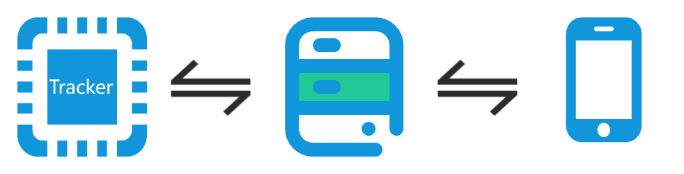
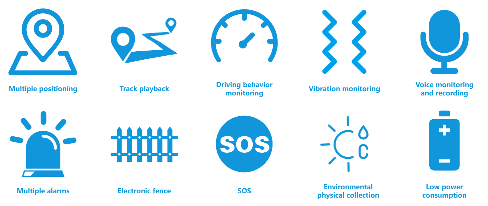
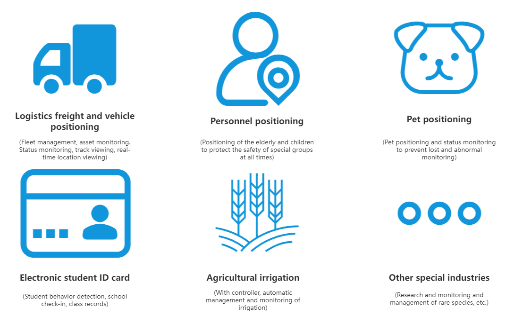
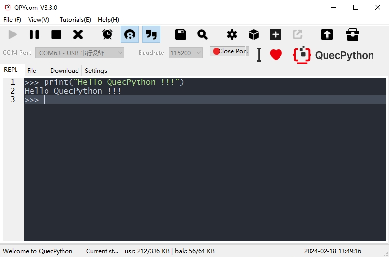
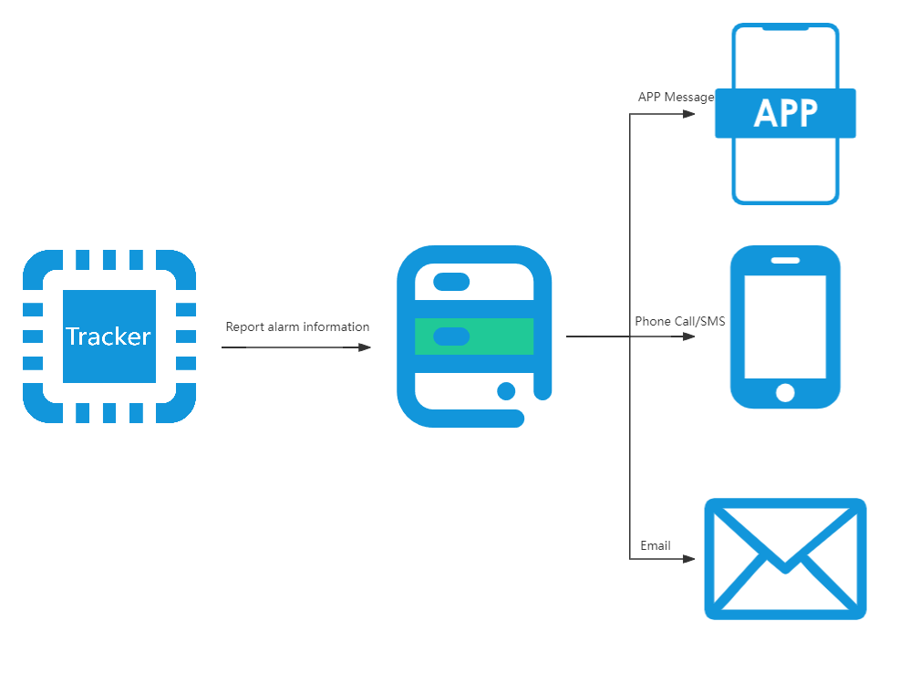
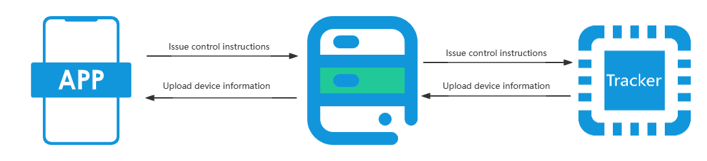

[中文](README_zh.md) | **English** |

## Revision History

| Version | **Date**   | **Author** | Description |
| :------ | ---------- | ---------- | --------------------- |
| 2.0     | 2022-03-15 | Jack SUN | Initial       |
| 2.1     | 2022-04-18 | Jack SUN | Added the chapter "Download Complete Code Project" |
| 2.2     | 2023-04-14 | Jack SUN | Adjusted Tracker functionality architecture |

## Introduction to Smart Tracker 

### Overview

- Smart tracker
- Terminal device functions meet the majority of requirements in tracker application scenarios
- The visual operation platform and the mobile app make device management and data viewing more convenient.

### Features

- Multi-technology geolocation, geo-fence alarm, danger alarm, SOS alarm reporting, voice monitoring, recording, historical track playback, remote control, etc.
- Smart positioning
    - The system utilizes 4G communication/multi-technology geolocation/distributed services to provide a one-stop solution from end to service for the smart tracker industry.
- All-platform support
    - The device operation platform and mobile app have complete functions, enabling terminal device manufacturers to quickly manage devices and end users without the need to build your own service platforms.
- Reliable and stable
    - The terminal device has high positioning accuracy, high sensitivity to danger perception, low power consumption, and stable operation. Terminal device manufacturers can develop customized solutions directly based on the public version, greatly shortening the hardware development cycle.

### Characteristics

- Intelligent perception, recognition, and reporting of location information and danger alarms.
- Support integration with various IoT platforms such as Alibaba IoT Platform, ThingsBoard, and other private services.
- Secondary development with QuecPython to formulate modular and customizable solutions, thus shortening development cycles.
- Visual operation platform and mobile app to control terminal devices.

### Applications

- Vehicle tracking
- Logistics and transportation
- People tracking
- Electronic student ID card
- Pet tracking
- Special industries (agricultural irrigation, rare species monitoring, etc.)

## Quectel Smart Tracker and Capabilities

### Capabilities

- **Support multiple platforms such as Alibaba IoT Platform, ThingsBoard, and private service platforms (Only Alibaba IoT Platform and ThingsBoard are supported currently, while others are under development)**
- **Support local and remote parameter configuration**
- **Support OTA upgrades**
- **Support offline data storage**
    - In unstable network connections, data that fails to be sent will be temporarily stored locally and prioritized for transmission to the server when the network is restored.
    - The amount of data stored offline can be configured through a configuration file.
- **Support common sensors and input devices**
    - Sensors
        - Ambient light sensor
        - Three-axis acceleration sensor
        - Temperature and humidity sensor
        - ...
    - Input devices
        - Microphone
        - ...
- **Support QuecPython, enabling rapid secondary development with Python**

### Supporting Component

#### QPYcom

QPYcom is a powerful tool that integrates **QuecPython REPL interaction, file transfer between PC and module, file system image making and packaging into the firmware, and firmware downloading**.

If you want to conduct secondary development, QPYcom will greatly improve your development efficiency.

[Click here to download QPYCom](https://python.quectel.com/download)

For the QPYCom user guide, refer to the `docs` folder in the installation directory.

### Advantages

- **Multi-technology Geolocation**
    - Support multiple technologies such as GPS, BD, GLONASS, Galileo, Wi-Fi and LBS to realize an accurate positioning in any corner of the world.
- **1000 mAh**
    - Ultra-low power consumption to realize ultra-long standby time (theoretical standby time longer than 8000 days).
- **Sensors**
    - Acceleration sensors, temperature and humidity sensors, and ambient light sensors greatly expand usage scenarios, including cold-chain transportation and logistics monitoring.
- **Wide-range Voltage Support**
    - Support voltage from 9 V to 108 V, covering small cars, large trucks, new energy vehicles and electric scooters.
- **Fast Positioning**
    - Support fast positioning with the help of AGPS.
- **Concealed Installation**
    - Magnetic, adhesive, fixed, and movable. The hidden tracker provides effective positioning. 
- **Low-cost Development**
    - Secondary development with Python reduces software development costs.
    
    - Applicable to multiple Quectel module models. Through Python development, you can quickly switch to different module models without modifying the code.
- **Strong Customer Service and Technical Support Capabilities**

## Workflow of Quectel Smart Tracker

### Danger Alarm and SOS Alarm Reporting

### Remote Control

## Download Complete Code Project

### Description

This project includes a sub-project named `modules`. When downloading the code, make sure to download the sub-project together.

### Download Steps

1. Download the main project code

- `git clone https://github.com/QuecPython/solution-tracker.git`

2. Enter the project root directory

- `cd solution-tracker/`

3. Switch to the corresponding main project branch

- `git checkout master`

4. Initialize the sub-project

- `git submodule init`

5. Download the sub-project code

- `git submodule update`

6. Enter the sub-project directory

- `cd code/modules/`

7. Switch to the corresponding sub-project branch

- `git checkout master`
