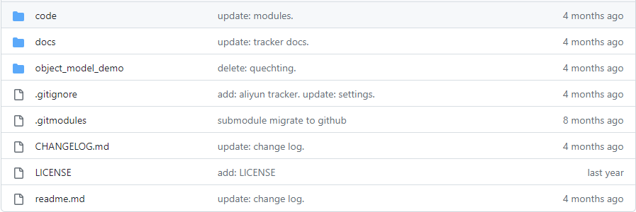
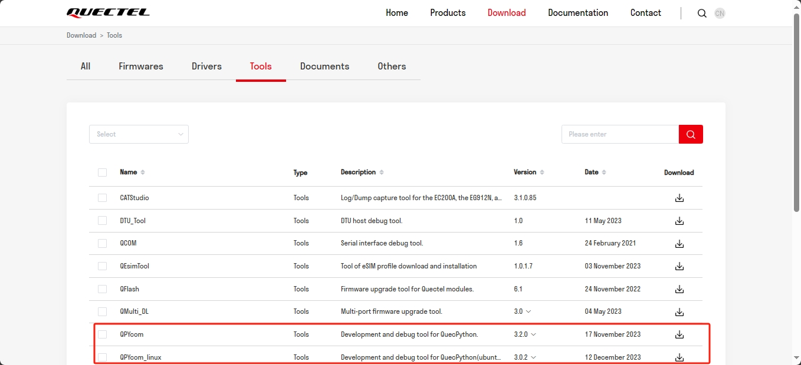
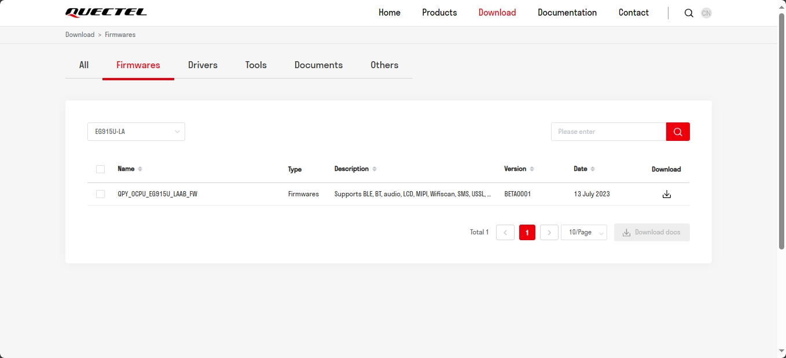
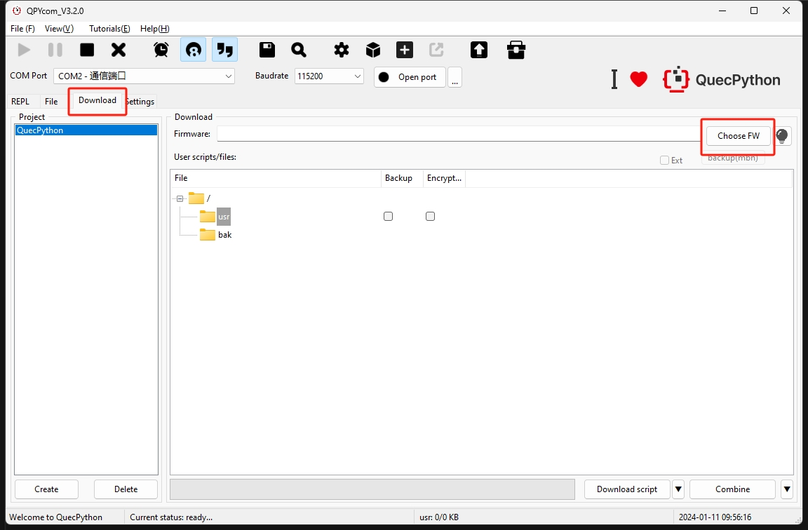
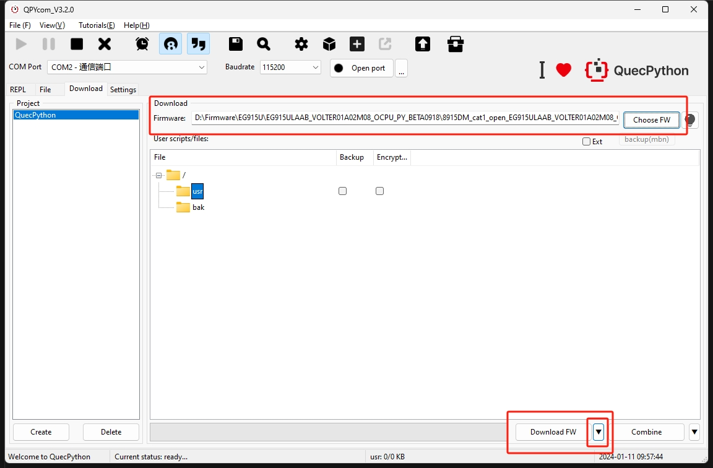
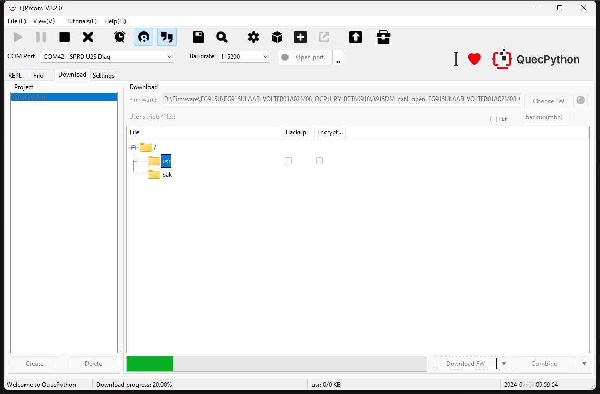
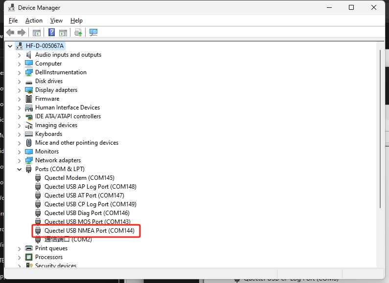
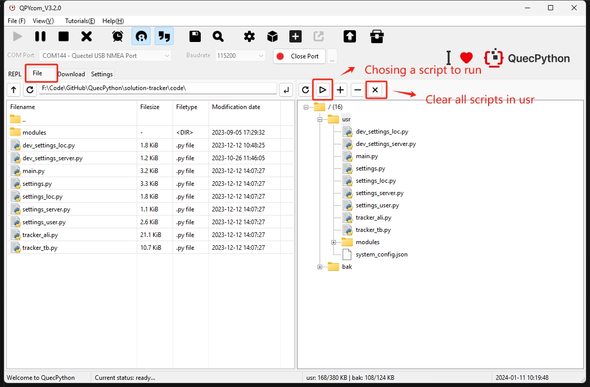

[中文](../zh/定位器方案应用指导.md) | **English** |

# Tracker Solution Application Note

## Introduction

This document introduces how to run the tracker solution program we provided on modules or devices. The operations demonstrated in this document are based on Quectel EG915U series module.

## Get Solution Resource

Tracker solution resources can be downloaded from [https://github.com/QuecPython/solution-tracker](https://github.com/QuecPython/solution-tracker)

> The solution project has a sub-project named `modules`. Do not forget to download the sub-project together.
>
> The command for downloading the sub-project synchronously: `git clone --recursive https://github.com/QuecPython/solution-tracker.git`

Resource package directory:



- *code*

This directory contains the software solution code.


- *docs*

This directory contains project documents such as user guides and functional interface specifications.


- *object_model_demo*

This directory contains a TSL model file of the Alibaba IoT Platform, which can be directly imported into the Alibaba IoT Platform for debugging.

## Solution Overview

This is a public version of the tracker solution, which does not include all functions. The solution provides the functional implementation of the core components of the tracker and functions such as data interaction, and event forwarding with the server. You can continue to develop business functions based on this framework. The current software framework has the following features:

- Data interaction over MQTT (Alibaba IoT Platform and ThingsBoard are supported currently.)
- Read and write configuration file
- OTA upgrade
- LED indicator
- Device network management
- Device information management
- Battery level and charging management
- Backup data storage
- GNSS positioning/LBS positioning/Wi-Fi positioning
- Low power management
- Log storage and recording

## Set up Environment

### Install USB Driver

Please download and install the driver according to the platform of the module to be debugged. [Click here to download USB Drivers](https://python.quectel.com/download)


### Download Development and Debugging Tool

It is recommended to use QPYcom for development and debugging. The processes described in this document are under the premise that QPYcom is used and USB driver installation is successful.

[Click here to download QPYcom](https://python.quectel.com/download)



[Click here to view QPYcom User Guide](https://python.quectel.com/doc/Application_guide/en/dev-tools/QPYcom/qpycom-gui.html)

### Modify Code Configuration Parameters

The configuration parameters used in the current solution code are not configured. Please modify configurations according to the instructions below.

Find the configuration files starting with `settings_` in the *code* folder and modify the configuration based on actual parameters, as shown below.

- `settings_server.py` is used to configure the IoT platform connection information.

```python
class AliIotConfig:

    product_key = ""
    product_secret = ""
    device_name = ""
    device_secret = ""
    server = "iot-as-mqtt.cn-shanghai.aliyuncs.com"
    qos = 1


class ThingsBoardConfig:

    host = ""
    port = 1883
    username = ""
    qos = 0
    client_id = ""
```

- `settings_loc.py` is used to configure the information of the module used for positioning (UART port of the external GNSS communication, authentication information for LBS/Wi-Fi positioning).

```python
gps_cfg = {
    "UARTn": UART.UART1,
    "buadrate": 115200,
    "databits": 8,
    "parity": 0,
    "stopbits": 1,
    "flowctl": 0,
    "gps_mode": _gps_mode.external,
    "nmea": 0b010111,
    "PowerPin": None,
    "StandbyPin": None,
    "BackupPin": None,
}

cell_cfg = {
    "serverAddr": "www.queclocator.com",
    "port": 80,
    "token": "xxxxxxxxxx",
    "timeout": 3,
    "profileIdx": profile_idx,
}

wifi_cfg = {
    "token": "xxxxxxxxxx"
}
```

- `settings_user.py` is used to configure parameters related to user business functions (e.g., alarm switch, low battery level threshold).

```python
class _server:
    none = 0x0
    AliIot = 0x1
    ThingsBoard = 0x2

class _drive_behavior_code:
    none = 0x0
    sharply_start = 0x1
    sharply_stop = 0x2
    sharply_turn_left = 0x3
    sharply_turn_right = 0x4

class _ota_upgrade_module:
    none = 0x0
    sys = 0x1
    app = 0x2```markdown
debug = 1
log_level = "DEBUG"
checknet_timeout = 60
server = _server.AliIot
phone_num = ""
low_power_alert_threshold = 20
low_power_shutdown_threshold = 5
over_speed_threshold = 50
sw_ota = 1
sw_ota_auto_upgrade = 1
sw_voice_listen = 0
sw_voice_record = 0
sw_fault_alert = 1
sw_low_power_alert = 1
sw_over_speed_alert = 1
sw_sim_abnormal_alert = 1
sw_disassemble_alert = 1
sw_drive_behavior_alert = 1
drive_behavior_code = _drive_behavior_code.none
loc_method = _loc_method.all
loc_gps_read_timeout = 300
work_mode = _work_mode.cycle
work_mode_timeline = 3600
work_cycle_period = 30
user_ota_action = -1
ota_status = {
    "sys_current_version": "",
    "sys_target_version": "--",
    "app_current_version": "",
    "app_target_version": "--",
    "upgrade_module": _ota_upgrade_module.none,
    "upgrade_status": _ota_upgrade_status.none,
}
```

### Download Firmware

Download the corresponding QuecPython firmware according to the current debugging module model from the QuecPython official website, and download the firmware into the module with QPYcom.

[Click here to download firmware](https://python.quectel.com/download)



Use QPYcom to download firmware.

1. Select firmware



2. Download firmware



3. Wait for the completion of firmware download



4. Successful download


5. Connect to the interactive port


6. View the download information


### Download Code

- It is recommended to rename the *`main.py`* file to *`_main.py`* before downloading the code because the *`main.py`* file will run automatically when the module is powered on, which is not convenient for debugging. During the test, we can manually run the *`_main.py`* file for easier debugging.

- When downloading the code via USB, you need to reserve a USB port or test point for the device. Or you can use an EVB for debugging, and install the driver in advance.

1. Select "**`Quectel USB NMEA PORT`**". This serial port is for interaction, and QPYcom logs will also be output through this serial port.



2. Download the business functional code to the device in batches. Click "**Download script**" and wait for the download to complete. After the download is complete, view the result on the "File" page.


3. After successful download, it is recommended to reboot the device and run the function (If the *`main.py`* file was downloaded, the function will run automatically after the device is rebooted; if the *`main.py`* file was renamed to *`_main.py`* before downloading, you need to manually run the *`_main.py`* file to start the function).



4. View the running result


