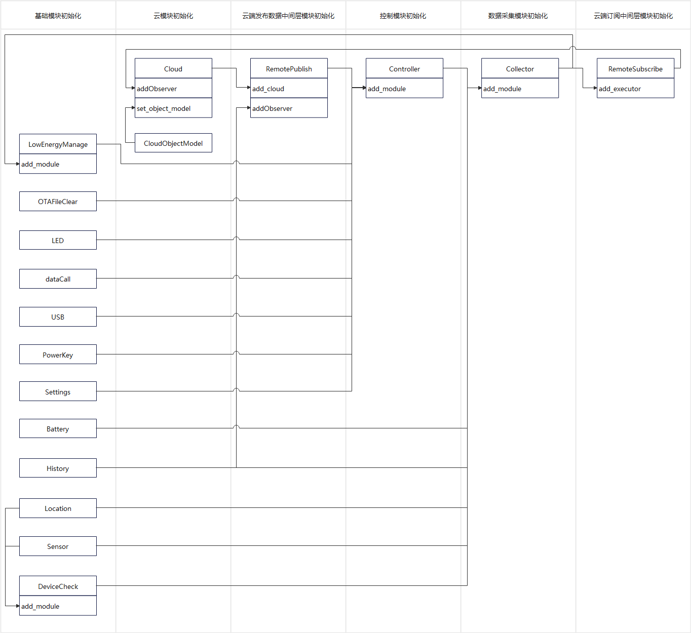

# Tracker 公版方案功能接口

## Tracker 功能列表

### 设备自动开关机与指示灯

#### 低电关机

- 开机状态下，电量≤`低电关机阈值(默认5%)`时，自动关机，关闭一切指示灯，并在关机前，需向云端报告一次设备信息。

#### 开机自检及运行状态指示灯(网络、GPS检测开发完成, 其他开发中)

- 开机自检
    - 检测网络、GPS模组、各类传感器(照度传感器，温湿度传感器，三轴加速度传感器)、麦克风是否正常工作；
- 运行状态指指示灯(根据开机自检结果显示)：
    - 正常：运行状态指示灯2s闪烁一次。
    - 异常：运行状态指示灯500ms闪烁一次；在网络正常的情况下，需向云端发出故障报警。

#### 电量指示灯(开发中)

- `低电告警阈值(默认30%)`<电量：常亮
- `低电关机阈值(默认5%)`<电量<=`低电告警阈值(默认30%)`：1秒闪烁一次
- 电量<=`低电关机阈值(默认5%)`：熄灭

### 设备信息交互功能

#### 多重定位

- 由GPS、WiFi或基站综合确定位置信息。
- 默认GPS定位，具体使用哪一种或几种定位技术，可由云端或手机APP控制。

#### 电子围栏(开发中)

- 由云端规划设备安全区域。 当设备位置超出安全区域，云端向设置的联系方式发送报警信息，如设置邮箱发送报警邮件，设置手机号拨打报警电话或发送报警短信。
- 该功能由云端支持。

#### 语音监听(开发中)

- 云端登记的手机号拨打tracker中的手机号时，自动接听，监听现场的声音。
- 功能的开启，可由云端或手机APP控制。默认开启该功能。

#### 录音上报(开发中)

- 自动录音并上报的功能，可由云端或手机APP控制。默认关闭该功能。

#### 部标808协议(开发中)

- 与云端之间的通信遵循808协议。

#### 设备信息上报

- 上报设备定位信息，电量，开关机状态，定位方式，电话号码等信息；
- 默认上报设备信息的场景：
    1. 周期性定时
    2. 报警发生时
    3. 语音监听时
    4. 录音时
- 根据不同的应用场景，上报工作模式分别有以下三种：
    1. 周期性模式 -- 周期性上报设备信息，上报完成后进入低功耗模式
    2. 智能模式 -- 开启GPS定位时，运动上报，上报完成后进入低功耗模式，静止不上报直接进入低功耗模式
- 上报工作模式与上报周期，由云端或手机APP控制，默认周期性上报，上报周期30秒。

#### OTA升级(开发中)

- 上电时，待网络连接后，检测是否需要更新升级。
- 如有升级：
    - 若非自动升级，则上云端上报有新的更新；
    - 在云端或手机APP点击升级按钮；
    - 下载升级包，并将升级包准备完毕的通知报给云端(移远云无需上报下载后直接升级)；
    - 升级完毕后，将升级状态报告给云端。
- 功能的开启，可由云端或手机APP控制。默认开启该功能。
- 功能开启的状态下，可由云端或手机APP配置是否自动升级。默认开启自动升级。

#### 远程配置或控制
- 远程配置：电话号码、远程配置定位器工作模式、定位使用的技术手段、语音监听、自动录音上报、固件升级及自动升级、故障报警、低电报警、超速报警、SIM卡异常报警、拆卸报警、振动报警和驾驶行为监测功能的开关。
- 远程控制：远程控制固件升级的流程。

### 设备报警功能

#### 故障报警

- 设备在开机自检或正常工作中遇到了故障时报警。
- 功能的开启，可由云端或手机APP控制。默认开启该功能。
- 报警代码：20000

#### 低电报警

- 电量低于设定值时报警。
- 低电的阈值默认为5%，可由云端或手机APP设置，但设定值限制在5%-30%。
- 功能的开启，可由云端或手机APP控制。默认开启该功能。
- 报警代码：30002

#### 超速报警

- 速度超过设定值时报警。
- 功能的开启，超速阈值，可由云端或手机APP控制。默认关闭该功能。
- 报警代码：30003

#### SIM卡异常报警

- SIM卡拔出时报警，此时网络不通，按照网络不通的逻辑处理。
- 功能的开启，可由云端或手机APP控制。默认开启该功能。
- 报警代码：30004

#### 拆卸报警(开发中)

- 照度传感器检测到较亮的光线时报警。
- 功能的开启，可由云端或手机APP控制。默认开启该功能。
- 报警代码：30005

#### 驾驶行为监测(开发中)

- 检测到急起急停或急转弯时，报驾驶行为异常。
- 功能的开启，可由云端或手机APP控制。默认关闭该功能。
- 驾驶行为异常的报警代码为：
    - 急起：40001
    - 急停：40002
    - 左急转弯：40003
    - 右急转弯：40004

#### SOS一键报警(开发中)

- 长按功能键5s，紧急求助。
- 先向云端发送紧急报警信息，同时向内置电话号码拨打电话、发送短信。
- 报警代码：50001

## Tracker 功能模块说明

### 功能模块注册流程图



### 功能模块说明

#### 业务功能模块

| 模块名称 | 模块功能 |
|---|---|
| Settings | 配置参数读写模块 |
| Collector | 采集器模块，主要用于采集各个功能模块数据，如传感器，电池，发送失败历史数据等；消息指令的接收，数据的整合与业务逻辑的处理。 |
| Controller | 控制器模块，主要用于设备功能模块的控制，如电源的重启与关机，LED的亮灭控制，配置文件的写入保存，云端消息的发送等。 |
| DeviceCheck | 设备状态检测模块，主要负责检测各个传感器模块，定位模块是否正常工作，网络拨号是否正常 |

#### 设备功能模块

| 模块名称 | 模块功能 |
|---|---|
| History | 历史文件读写操作模块 |
| Battery | 电池模块，获取电池电量与电压 |
| LowEnergyManage | 低功耗唤醒模块，用于设置不同级别的低功耗模型，定时唤醒模块进行业务工作。 |
| Location | 定位模块，可获取GPS，基站，WIFI三种定位方式的定位信息。 |
| AliYunIot | 阿里云模块，主要用于与云端的消息交互与OTA升级 |
| AliObjectModel | 阿里云物模型抽象类，将阿里云导出的精简物模型（json格式）抽象为一个类进行功能使用 |
| RemotePublish | 云端消息发布类，用于兼容不同云的消息发布与OTA升级检测与确认 |
| RemoteSubscribe | 云端消息订阅类，用于兼容不同云端的下发消息 |

## Tracker API v2.1.0

### settings

> 该模块为配置参数模块

- 项目配置主要分为三个大块
    + 系统配置模块:
        * settings_sys.SYSConfig
    + 用户配置模块:
        * settings_user.UserConfig
    + 功能模块配置:
        * settings_loc.LocConfig
        * settings_alicloud.AliCloudConfig
        * settings_queccloud.QuecCloudConfig
- 该模块将配置好的模块设置集成到一个`DICT`中，可通过`settings.get()`方式获取到具体配置参数
- 全局变量:
    + `PROJECT_NAME` -- 项目名称
    + `PROJECT_VERSION` -- 项目版本
    + `DEVICE_FIRMWARE_NAME` -- 设备版本
    + `DEVICE_FIRMWARE_VERSION` -- 固件版本
    
#### 全局变量导入

例:

```python
from usr.settings import PROJECT_NAME
from usr.settings import PROJECT_VERSION
from usr.settings import DEVICE_FIRMWARE_NAME
from usr.settings import DEVICE_FIRMWARE_VERSION
```

#### settings 导入

例:

```python
from usr.settings import settings
```

#### init 初始化

> 功能:
> 
> - 检查持久化配置文件是否存在，存在则直接读取配置文件配置
> - 若不存在则读取`SYSConfig`设置参数, 根据配置读取用户配置与功能配置
> - 读取完成所有配置参数后，将配置参数写入配置文件中持久化存储

例:

```python
res = settings.init()
```

参数:

无

返回值:

|数据类型|说明|
|:---|---|
|BOOL|`True`成功, `False`失败|

#### get 获取配置参数

例:

```python
current_settings = settings.get()
```

参数:

无

返回值:

|数据类型|说明|
|:---|---|
|DICT|配置参数|

```json
{
    "sys": {
        "checknet_timeout": 60,
        "log_level": "DEBUG",
        "debug": true,
        "user_cfg": true,
        "cloud": 2,
        "base_cfg": {
            "LocConfig": true
        }
    },
    "cloud": {
        "burning_method": 1,
        "SERVER": "XXX.iot-as-mqtt.cn-shanghai.aliyuncs.com",
        "DK": "XXX",
        "life_time": 120,
        "PS": "XXX",
        "DS": "XXX",
        "PK": "XXX",
        "client_id": ""
    },
    "user_cfg": {
        "sw_sim_abnormal_alert": true,
        "work_mode": 1,
        "phone_num": "",
        "user_ota_action": -1,
        "drive_behavior_code": 0,
        "loc_method": 1,
        "low_power_alert_threshold": 20,
        "work_mode_timeline": 3600,
        "low_power_shutdown_threshold": 5,
        "ota_status": {
            "sys_target_version": "--",
            "upgrade_module": 0,
            "upgrade_status": 0,
            "app_current_version": "2.1.0",
            "app_target_version": "--",
            "sys_current_version": "EC600NCNLCR01A01M08_PY_BETA0421"
        },
        "sw_low_power_alert": true,
        "over_speed_threshold": 50,
        "sw_disassemble_alert": true,
        "sw_fault_alert": true,
        "sw_voice_record": false,
        "sw_voice_listen": false,
        "sw_drive_behavior_alert": true,
        "work_cycle_period": 30,
        "sw_over_speed_alert": true,
        "sw_ota": true,
        "sw_ota_auto_upgrade": true
    },
    "LocConfig": {
        "profile_idx": 1,
        "gps_mode": 2,
        "map_coordinate_system": "WGS84",
        "locator_init_params": {
            "cell_cfg": {
                "timeout": 3,
                "profileIdx": 1,
                "port": 80,
                "serverAddr": "www.queclocator.com",
                "token": "XXX"
            },
            "wifi_cfg": {
                "token": "XXX"
            },
            "gps_cfg": {
                "parity": 0,
                "stopbits": 1,
                "flowctl": 0,
                "UARTn": 1,
                "buadrate": 115200,
                "databits": 8,
                "gps_mode": 2
            }
        },
        "loc_method": 1
    }
}
```

#### set 设置配置参数

> 配置参数标识符列表，见 `settings_user` 中 `UserConfig` 具体属性

例:

```python
opt = 'phone_num'
val = '123456789'
res = settings.set(opt, val)
```

参数:

|参数|类型|说明|
|:---|---|---|
|opt|STRING|配置参数标识符|
|val|STRING/BOOL/INT/DICT|配置参数属性值|

返回值:

|数据类型|说明|
|:---|---|
|BOOL|`True`成功, `False`失败|

#### save 持久化保存配置参数

> 将配置参数写入文件进行持久化保存，文件名全路径`/usr/tracker_settings.json`

例:

```python
res = settings.save()
```

参数:

无

返回值:

|数据类型|说明|
|:---|---|
|BOOL|`True`成功, `False`失败|

#### remove 删除配置参数文件

例:

```python
res = settings.remove()
```

参数:

无

返回值:

|数据类型|说明|
|:---|---|
|BOOL|`True`成功, `False`失败|

#### reset 重置配置参数

> 先移除配置参数文件, 再重新生成配置参数文件

例:

```python
res = settings.reset()
```

参数:

无

返回值:

|数据类型|说明|
|:---|---|
|BOOL|`True`成功, `False`失败|

### settings_sys

> 系统配置参数，主要用于配置debug日志的开启关闭，日志等级，使用的云平台，基础模块启用设置，用户配置启用设置。
用户只用在对应的配置模块中将配置参数录入完整之后，调用`settings`模块进行初始化即可集成所有配置参数和配置文件。

#### SYSConfig

> 系统配置参数列表

| 参数           | 类型 | 说明                                                                        |
| ---------------- | ------ | ----------------------------------------------------------------------------- |
| debug            | BOOL   | 是否开启debug日志,True - 开启,False - 关闭                          |
| log_level        | STRING | 日志等级,debug,info,warn,error,critical                                   |
| cloud            | INT    | 项目使用云平台,0 - none,1 - quecIot,2 - AliYun                         |
| checknet_timeout | INT    | 网络检测超时时间，单位s，默认60s                                |
| base_cfg         | DICT   | 基础模块启用配置,key：为模块配置名称,value：是否启用,True - 启用,False - 禁用 |
| user_cfg         | BOOL   | 是否启用用户具体业务配置文件,True - 开启,False - 关闭       |

> `base_cfg` 样例

```json
{
    "LocConfig": true,
}
```

> 系统配置参数枚举值

SYSConfig.\_cloud 支持云服务列表

| KEY | VALUE | 说明 |
|---|---|---|
| none | 0x0 | 无 |
| quecIot | 0x1 | 移远云 |
| AliYun | 0x2 | 阿里云 |
| JTT808 | 0x4 | 部标808 |
| customization | 0x8 | 定制云 |

### settings_loc

> 定位模块相关配置，GPS，基站，WIFI初始化配置参数，定位方式，坐标系统，GPS模块类型。

#### LocConfig

> 定位模块配置参数列表

| 参数                    | 类型   | 说明                                                                |
|-----------------------    |--------   |------------------------------------------------------------------ |
| profile_idx               | INT       | PDP索引，ASR平台范围1-8，展锐平台范围1-7，默认1。                   |
| \_gps_cfg                  | DICT      | 外置GPS UART 串口配置参数                                         |
| \_cell_cfg                 | DICT      | 基站定位配置参数                                                  |
| \_wifi_cfg                 | DICT      | WIFI定位配置参数。                                                   |
| loc_method                | INT       | GPS定位方式,以二进制方式组合,设置多个,1 - GPS,2 - 基站, 4 - WIFI    |
| map_coordinate_system     | STRING    | GPS坐标系统,WGS84,GCJ02                                           |
| locator_init_params       | DICT      | 不同定位方式参数汇总                                                |

> 字典类型数据说明与样例

\_gps_cfg

| 参数        | 类型   | 说明                                        |
|---------- |--------   |-----------------------------------------  |
| UARTn     | INT       | UART串口号，默认1                           |
| buadrate  | INT       | 波特率                                    |
| databits  | INT       | 数据位（5 ~ 8），展锐平台当前仅支持8位    |
| parity    | INT       | 奇偶校验（0 – NONE，1 – EVEN，2 - ODD）   |
| stopbits  | INT       | 停止位（1 ~ 2）                            |
| flowctl   | INT       | 硬件控制流（0 – FC_NONE， 1 – FC_HW）     |
| gps_mode  | INT       | GPS模块类型,0 - 无,1 - 内置GPS,2 - 外置GPS                         |

样例:

```json
{
    "UARTn": 1,
    "buadrate": 115200,
    "databits": 8,
    "parity": 0,
    "stopbits": 1,
    "flowctl": 0,
    "gps_mode": 1
}
```

\_cell_cfg

| 参数        | 类型  | 说明                                                                    |
|------------   |---------- |---------------------------------------------------------------------  |
| serverAddr    | STRING    | 服务器域名，长度必须小于255 bytes，目前仅支持 “www.queclocator.com”     |
| port          | INT       | 服务器端口，目前仅支持 80 端口                                         |
| token         | STRING    | 密钥，16位字符组成，需要申请                                           |
| timeout       | INT       | 设置超时时间，范围1-300s，默认300s                                    |
| profileIdx    | INT       | PDP索引，ASR平台范围1-8，展锐平台范围1-7                                |

样例:

```json
{
    "serverAddr": "www.queclocator.com",
    "port": 80,
    "token": "XXX",
    "timeout": 3,
    "profileIdx": 1
}
```

\_wifi_cfg

| 参数        | 类型  | 说明                                                                    |
|------------   |---------- |---------------------------------------------------------------------  |
| token         | STRING    | 密钥，16位字符组成，需要申请                                           |

样例:

```json
{
    "token": "XXX"
}
```

locator_init_params

| 参数          | 类型   | 说明                                                      |
|------------   |---------- |---------------------------------------------------------  |
| gps_cfg       | DICT      | GPS定位配置参数                                           |
| cell_cfg      | DICT      | 基站定位配置参数                                           |
| wifi_cfg      | DICT      | WIFI定位配置参数                                           |

样例:

```json
{
    "gps_cfg": {
        "UARTn": 1,
        "buadrate": 115200,
        "databits": 8,
        "parity": 0,
        "stopbits": 1,
        "flowctl": 0,
        "gps_mode": 1
    },
    "cell_cfg": {
        "serverAddr": "www.queclocator.com",
        "port": 80,
        "token": "XXX",
        "timeout": 3,
        "profileIdx": 1
    },
    "wifi_cfg": {
        "token": "XXX"
    }
}
```

> 定位配置参数枚举值

LocConfig.\_gps_mode GPS模块类型列表

| KEY | VALUE | 说明 |
|---|---|---|
| none | 0x0 | 无 |
| internal | 0x1 | 内置GPS |
| external | 0x2 | 外置GPS |

LocConfig.\_loc_method 定位方式列表, 可指定多种定位方式

| KEY | VALUE | 说明 |
|---|---|---|
| none | 0x0 | 无 |
| gps | 0x1 | GPS |
| cell | 0x2 | CELL |
| wifi | 0x4 | WIFI |
| all | 0x7 | GPS & CELL & WIFI |

LocConfig.\_map_coordinate_system GPS坐标系统

| KEY | VALUE | 说明 |
|---|---|---|
| WGS84 | WGS84 | WGS84 |
| GCJ02 | GCJ02 | GCJ02 |

LocConfig.\_gps_sleep_mode GPS休眠模式

| KEY | VALUE | 说明 |
|---|---|---|
| none | 0x0 | 无 |
| pull_off | 0x1 | 断电休眠模式，功耗最低，启动时间长（目前只适用L76K模块） |
| backup | 0x2 | Backup休眠模式，功耗一般，启动时间中等（目前只适用L76K模块） |
| standby | 0x3 | Standby休眠模式，功耗稍高，启动时间快（目前只适用L76K模块） |

### settings_alicloud

> 阿里云模块初始化配置参数

#### AliCloudConfig

> 阿里云模块配置参数列表

| 参数 | 类型 | 说明 |
|---|---|---|
| PK | STRING | 产品标识ProductKey |
| PS | STRING | 可选参数，默认为None，productSecret，产品密钥 一机一密认证方案时，此参数传入None 一型一密认证方案时，此参数传入真实的产品密钥 |
| DK | STRING | DeviceName,设备名称 |
| DS | STRING | DeviceSecret,可选参数,默认为None，设备密钥（一型一密认证方案时此参数传入None） |
| SERVER | STRING | 可选参数,需要连接的服务器名称,默认为"{productKey}.iot-as-mqtt.cn-shanghai.aliyuncs.com" |
| client_id | STRING | 自定义阿里云连接id,默认DK |
| life_time | INT | 通信之间允许的最长时间段（以秒为单位）,默认为120，范围（60-1200） |
| burning_method | INT | 认证方案，0 - 一型一密，1 - 一机一密 |

> 阿里云配置参数枚举值

AliCloudConfig.\_burning_method 设备密钥认证方式

| KEY | VALUE | 说明 |
|---|---|---|
| one_type_one_secret | 0x0 | 一型一密 |
| one_machine_one_secret | 0x1 | 一机一密 |

### settings_queccloud

> 移远云模块初始化配置参数

#### QuecCloudConfig

> 移远云模块配置参数列表

| 参数 | 类型 | 说明 |
|---|---|---|
| PK | STRING | ProductKey产品标识 |
| PS | STRING | ProductSecret产品密钥 |
| DK | STRING | DeviceName设备名称, 默认空 |
| DS | STRING | DeviceSecret设备密钥, 默认空 |
| SERVER | STRING | 可选参数,需要连接的服务器名称,默认为"iot-south.quectel.com:1883" |
| life_time | INT | 通信之间允许的最长时间段（以秒为单位）,默认为120，范围（60-1200） |

### Collector 采集器

> 采集器模块，主要用于采集各个功能模块数据，如传感器，电池，发送失败历史数据等；消息指令的接收，数据的整合与业务逻辑的处理。

#### ALERTCODE 告警类型编码表

例:

```python
from usr.tracker_collector import ALERTCODE
```

| 编码 | 标识符 | 说明 |
|---|---|---|
| 20000 | fault_alert | 设备异常告警 |
| 30002 | low_power_alert | 低电告警 |
| 30003 | over_speed_alert | 超速告警 |
| 30004 | sim_abnormal_alert | SIM卡异常告警 |
| 30005 | disassemble_alert | 拆卸告警 |
| 40000 | drive_behavior_alert | 异常驾驶行为告警 |
| 50001 | sos_alert | SOS告警 |

#### Collector 导入

例:

```python
from usr.tracker_collector import Collector

collector = Collector()
```

#### add_module 注册功能模块

> 可注册模块:
>
> - `Controller`
> - `DeviceCheck`
> - `Battery`
> - `Sensor`
> - `Location`
> - `History`
>
> 业务功能:
> 
> 将需要进行数据采集的设备模块与控制器模块以注册的方式添加进采集器模块

例:

```python
from usr.modules.battery import Battery
battery = Battery()
collector.add_module(battery)
```

参数:

| 参数 | 类型 | 说明 |
|---|---|---|
| module | object | 模块对象 |

返回值:

|数据类型|说明|
|:---|---|
|BOOL|`True`成功, `False`失败|

#### device_status_get 设备模块状态获取

> 依赖模块:
> 
> - `DeviceCheck`
> - `Controller`
>
> 业务功能:
> 
> 获取设备的各个模块的功能状态, 如有异常则同步返回异常告警数据

例:

```python
res = collector.device_status_get()
```

参数:

无

返回值:

|数据类型|说明|
|:---|---|
|DICT|设备状态信息与告警信息|

| EKY | VALUE | 数据类型 | 说明 |
|---|---|---|---|
| device_module_status |  | DICT | 设备模块状态， 0 - 异常；1 - 正常；模块不存在则无对应标识符 |
|  | net | INT | 网络状态 |
|  | location | INT | 定位状态 |
|  | temp_sensor | INT | 温湿度传感器状态 |
|  | light_sensor | INT | 光明传感器状态 |
|  | move_sensor | INT | 三轴传感器状态 |
|  | mike | INT | 麦克风状态 |
| fault_alert |  | DICT | 有设备异常时，该数据存在，无异常，该数据不存在 |
|  | local_time | STRING | 当前时间，毫秒时间戳 |

```json
{
    "device_module_status": {
        "net": 1,
        "location": 1,
        "temp_sensor": 1,
        "light_sensor": 1,
        "move_sensor": 1,
        "mike": 1
    },
    "fault_alert": {
        "local_time": "1651136994000"
    }
}
```
#### device_status_check 设备状态检测并上报设备信息

> 依赖模块:
> 
> - `Controller`
> - `DeviceCheck`
>
> 业务功能:
> 
> 1. 该模块先获取设备模块状态信息
> 2. 调用设备信息上报接口上报设备信息

例:

```python
collector.device_status_check()
```

参数:

无

返回值:

|数据类型|说明|
|:---|---|
|BOOL|`True`成功, `False`失败|

#### device_data_get 设备与业务信息数据收集

> 获取上报云端的所有数据信息并整合成`DICT`。

例:

```python
collector.device_data_get(power_switch=True)
```

参数:

| 参数 | 类型 | 说明 |
|---|---|---|
| power_switch | BOOL | 设备电源状态，True - 开机，False - 关机，默认True，当关机上报数据时，传入False |

返回值:

|数据类型|说明|
|:---|---|
|DICT|设备信息与业务信息|

```json
{
    "drive_behavior_code": 0,
    "current_speed": 2.46,
    "voltage": 4274,
    "ota_status": {
        "upgrade_status": 0,
        "app_target_version": "--",
        "sys_current_version": "EC600NCNLCR01A01M08_PY_BETA0421",
        "app_current_version": "2.1.0",
        "upgrade_module": 0,
        "sys_target_version": "--"
    },
    "sw_voice_listen": false,
    "loc_method": {
        "cell": false,
        "gps": true,
        "wifi": false
    },
    "sw_ota_auto_upgrade": true,
    "energy": 100,
    "low_power_alert_threshold": 20,
    "work_mode_timeline": 3600,
    "sw_voice_record": false,
    "sw_disassemble_alert": true,
    "sw_sim_abnormal_alert": true,
    "GeoLocation": {
        "CoordinateSystem": 1,
        "Latitude": 31.82249895,
        "Longitude": 117.1155386833333,
        "Altitude": 147.136
    },
    "device_module_status": {
        "net": 1,
        "location": 1
    },
    "power_switch": true,
    "sw_drive_behavior_alert": true,
    "over_speed_threshold": 50,
    "work_cycle_period": 30,
    "user_ota_action": -1,
    "phone_num": "",
    "low_power_shutdown_threshold": 5,
    "sw_low_power_alert": true,
    "sw_fault_alert": true,
    "work_mode": 1,
    "local_time": "1651138075000",
    "loc_gps_read_timeout": 300,
    "sw_ota": true,
    "sw_over_speed_alert": true
}
```

#### device_data_report 设备与业务信息上报云端

> 依赖模块:
>
> - `Controller`
>
> 业务功能:
> 
> 1. 该模块先获取设备业务信息数据
> 2. 与传入的事件数据合并后发送云端
> 3. 检测OTA升级状态, 如果OTA升级状态为失败或完成, 此时状态已上报云端, 所以更新状态为无更新

例:

```python
res = collector.device_data_report(power_switch=True, event_data={})
```

参数:

| 参数 | 类型 | 说明 |
|---|---|---|
| power_switch | BOOL | 设备电源状态，True - 开机，False - 关机，默认True，当关机上报数据时，传入False |
| event_data | DICT | 事件数据 |

返回值:

|数据类型|说明|
|:---|---|
|BOOL|`True`成功, `False`失败|

#### ota_status_reset 设备OTA升级信息初始化

> 依赖模块:
> 
> - `Controller`
> 
> 业务功能:
> 
> - 将设备OTA升级信息初始化, 该数据为自定义物模型数据
> - 设置字段:
> 
> ```json
> {
>     "sys_current_version": "DEVICE_FIRMWARE_VERSION",
>     "sys_target_version": "--",
>     "app_current_version": "PROJECT_VERSION",
>     "app_target_version": "--",
>     "upgrade_module": 0,
>     "upgrade_status": 0,
> }
> ```

例:

```python
collector.ota_status_reset()
```

参数:

无

返回值:

|数据类型|说明|
|:---|---|
|BOOL|`True`成功, `False`失败|

#### ota_status_init 设备OTA升级信息初始化

> 依赖模块:
> 
> - `Controller`
> 
> 业务功能:
> 
> - 该功能在设备启动时运行
> - 检测当前设备的OTA升级状态记录是否有升级计划
> - 当有升级计划时，检测当前设备版本与升级计划目标版本是否一致
> - 当一致时，且升级状态不为已完成时，设置升级状态为已完成
> - 当不一致时，且升级状态不为失败时，设置升级状态为升级失败

例:

```python
collector.ota_status_init()
```

参数:

无

返回值:

|数据类型|说明|
|:---|---|
|BOOL|`True`成功, `False`失败|

#### report_history 设备历史上报失败数据重新上报

> 依赖模块:
> 
> - `Controller`, `History`
> 
> 业务功能:
> 
> - 查询历史上报失败数据
> - 上报云端
> - 成功则丢弃上报完成的数据
> - 失败则继续写入历史文件中


例:

```python
collector.report_history()
```

参数:

无

返回值:

|数据类型|说明|
|:---|---|
|BOOL|`True`成功, `False`失败|

#### event_option 云端透传数据下发功能

> 依赖模块:
> 
> - `Controller`
> 
> 业务功能:
> 
> - 该模块为`RemoteSubscribe`透传数据下发监听功能
> - 收到被监听者的消息通知时，进行处理
> - 目前Tracker暂未使用该功能


例:

```python
collector.event_option(*args, **kwargs)
```

参数:

| 参数 | 类型 | 说明 |
|---|---|---|
| args | TUPLE | 元素1为属性标识符, 元素2为具体透传数据 |
| kwargs | DICT | 字典数据(作为扩展数据，暂无用处) |

返回值:

无

#### event_done 云端物模型属性设置功能

> 依赖模块:
> 
> - `Controller`
> 
> 业务功能:
> 
> - 该模块为`RemoteSubscribe`物模型属性设置监听功能
> - 收到被监听者的消息通知时，进行处理
> - 将属性写入`settings.current_settings`中
> - 将`settings.current_settings`写入文件中持久化存储
> - 根据不同的数据进行具体业务处理


例:

```python
collector.event_done(*args, **kwargs)
```

参数:

| 参数 | 类型 | 说明 |
|---|---|---|
| args | TUPLE | 元素1为属性标识符, 元素2为具体设置属性值 |
| kwargs | DICT | 字典数据(作为扩展数据，暂无用处) |

返回值:

|数据类型|说明|
|:---|---|
|BOOL|`True`成功, `False`失败|

#### event_query 云端查询设备信息功能

> 依赖模块:
> 
> - `Controller`
> 
> 业务功能:
> 
> - 该模块为`RemoteSubscribe`云端查询设备信息监听功能
> - 收到被监听者的消息通知时，进行处理
> - 直接调用`device_data_report`上报设备信息
> - 阿里云不支持云端下发查询指令进行上报设备信息，移远云目前支持该功能


例:

```python
collector.event_query(*args, **kwargs)
```

参数:

| 参数 | 类型 | 说明 |
|---|---|---|
| args | TUPLE | 元组数据(作为扩展数据，暂无用处) |
| kwargs | DICT | 字典数据(作为扩展数据，暂无用处) |

返回值:

|数据类型|说明|
|:---|---|
|BOOL|`True`成功, `False`失败|

#### event_ota_plain OTA升级计划处理功能

> 依赖模块:
> 
> - `Controller`
> 
> 业务功能:
> 
> - 该模块为`RemoteSubscribe`OTA升级计划信息监听功能
> - 收到被监听者的消息通知时，进行处理
> - 检测设备是否开启OTA升级，否则取消OTA升级
> - 检测设备是否开启自动OTA升级，否则等待用户确认升级
> - 检测用户是否确认OTA升级，否则取消OTA升级
> - 更新OTA设备升级状态记录
> - 调用`Controller.remote_ota_action`功能进行OTA升级


例:

```python
collector.event_ota_plain(*args, **kwargs)
```

参数:

| 参数 | 类型 | 说明 |
|---|---|---|
| args | TUPLE | 元组数据(元素1为OTA升级计划具体数据) |
| kwargs | DICT | 字典数据(作为扩展数据，暂无用处) |

阿里云OTA升级计划参数

```python
(("ota_cfg", {"module": "", "version": ""}),)
```

移远云OTA升级计划参数

```python
(("ota_cfg", {"componentNo": "", "targetVersion": ""}),)
```

返回值:

无

#### event_ota_file_download 阿里云OTA设备请求下载文件分片

> 依赖模块:
> 
> - `Controller`
> 
> 业务功能:
> 
> - 该模块为`RemoteSubscribe`透传数据下发监听功能
> - 收到被监听者的消息通知时，进行处理
> - 目前Tracker暂未使用该功能


例:

```python
collector.event_ota_file_download(*args, **kwargs)
```

参数:

| 参数 | 类型 | 说明 |
|---|---|---|
| args | TUPLE | 元素1为属性标识符, 元素2为具体透传数据 |
| kwargs | DICT | 字典数据(作为扩展数据，暂无用处) |

返回值:

无

#### rrpc_request MQTT同步通信(RRPC)

> 依赖模块:
> 
> - `Controller`
> 
> 业务功能:
> 
> - 该模块为`RemoteSubscribe`MQTT同步通信(RRPC)监听功能
> - 收到被监听者的消息通知时，进行处理
> - 目前Tracker暂未使用该功能


例:

```python
collector.rrpc_request(*args, **kwargs)
```

参数:

| 参数 | 类型 | 说明 |
|---|---|---|
| args | TUPLE | 元组数据(作为扩展数据，暂无用处) |
| kwargs | DICT | 字典数据, 包含两个key值，message_id(RRPC消息编号)与data(RRPC消息内容) |

返回值:

无

#### power_switch 下发电源状态控制指令

> 依赖模块:
> 
> - `Controller`
> 
> 业务功能:
> 
> - 当收到设置开关机命令时上报设备信息
> - 当为关机命令时，即`onoff`为False，上报信息完成后，关闭设备电源


例:

```python
collector.power_switch(onoff)
```

参数:

| 参数 | 类型 | 说明 |
|---|---|---|
| onoff | BOOL | True - 开机, False - 关机 |

返回值:

无

#### user_ota_action 下发指令用户确认是否OTA升级

> 依赖模块:
> 
> - `Controller`
> 
> 业务功能:
> 
> - 记录用户设置参数，0-取消升级，1-确认升级
> - 调用查询OTA升级接口进行升级


例:

```python
collector.user_ota_action(action)
```

参数:

| 参数 | 类型 | 说明 |
|---|---|---|
| action | INT | 0 - 取消升级，1 - 确认升级 |

返回值:

无

#### ota_status 设置OTA升级状态

> 依赖模块:
> 
> - `Controller`
> 
> 业务功能:
> 
> - 记录OTA升级状态，1-待升级，2-升级中，3-升级成功，4-升级失败


例:

```python
collector.ota_status(upgrade_info)
```

参数:

| 参数 | 类型 | 说明 |
|---|---|---|
| upgrade_info | TUPLE | (ota_module, upgrade_status, ota_module_version) 元素1为升级模块，元素2为升级状态，元素3为升级目标版本 |

返回值:

|数据类型|说明|
|:---|---|
|BOOL|`True`成功, `False`失败|

#### loc_method 设置定位方式

> 依赖模块:
> 
> - `Controller`
> 
> 业务功能:
> 
> - 解析并记录定位方式，由于物模型定义的定位方式为结构体，每种定位方式的禁用启用以0，1进行表示，而代码逻辑中定位方式是以二进制位的方式进行表示，所以需要进行转换
> - loc_method枚举值对应关系表:

| method | 说明 |
|---|---|
| 0x0 | 无 |
| 0x1 | GPS |
| 0x2 | CELL |
| 0x3 | GPS & CELL |
| 0x4 | WIFI |
| 0x5 | WIFI & GPS |
| 0x6 | WIFI & CELL |
| 0x7 | GPS & CELL & WIFI |


例:

```python
collector.loc_method(method)
```

参数:

| 参数 | 类型 | 说明 |
|---|---|---|
| method | INT | 0 - 7，十进制转二进制后，从右往左第一位表示GPS定位的开启关闭，第二位表示基站定位的开启关闭，第三位表示WIFI定位的开启关闭, 如: 3 对应二进制为 `0b011`, 对应的定位方式即为GPS&基站 |

返回值:

|数据类型|说明|
|:---|---|
|BOOL|`True`成功, `False`失败|

#### power_restart 重启设备指令

> 依赖模块:
> 
> - `Controller`
> 
> 业务功能:
> 
> - 标记电源状态关闭，并上报设备信息
> - 将设备模块重启


例:

```python
collector.power_restart(flag)
```

参数:

| 参数 | 类型 | 说明 |
|---|---|---|
| flag | INT | 1，设备重启 |

返回值:

无

#### work_cycle_period 重置设备周期唤醒时间

> 依赖模块:
> 
> - `Controller`
> 
> 业务功能:
> 
> - 先将未触发唤醒的定时器取消
> - 按新的唤醒周期启动唤醒定时器


例:

```python
collector.work_cycle_period(period)
```

参数:

| 参数 | 类型 | 说明 |
|---|---|---|
| period | INT | 休眠周期唤醒时间，单位s |

返回值:

|数据类型|说明|
|:---|---|
|BOOL|`True`成功, `False`失败|

#### low_engery_option 低功耗唤醒后业务功能

> 依赖模块:
> 
> - `Controller`
> 
> 业务功能:
> 
> - 低功耗唤醒后业务功能逻辑
>     + 上报历史数据
>     + 上报设备版本信息
>     + OTA升级计划查询
>     + 检测是否为智能模式，当为智能模式时，检测当前设备是否在运动中，是则上报设备信息，否则继续休眠
>     + 当为非智能模式时，上报设备数据
>     + 检测当前电量是否低于低电关机阈值，是否需要关机
>     + 启动休眠唤醒定时器
>     + 当低功耗模式为`POWERDOWN`时，关机

例:

```python
collector.low_engery_option(low_energy_method)
```

参数:

| 参数 | 类型 | 说明 |
|---|---|---|
| low_energy_method | STRING | 目前的低功耗模式有`NULL`, `PM`, `PSM`, `POWERDOWN` |

返回值:

无

#### update 监听者消息通知接口

> 业务功能:
> 
> - 做为监听者，当被监听者产生变化时，通知监听者
> - 当`observable`为`LowEnergyManage`对象时，调用`low_engery_option`功能


例:

```python
collector.update(observable, *args, **kwargs)
```

参数:

| 参数 | 类型 | 说明 |
|---|---|---|
| observable | OBJECT | 被监听者实例对象 |
| args | TUPLE | 元组数据，元素1为被监听者实例对象，元素2为具体参数 |
| kwargs | DICT | 字典数据(作为扩展数据，暂无用处) |

返回值:

无

### Controller 控制器

> 控制器模块，主要用于控制各个功能模块，如电源关闭与重启，发送数据等。

#### Controller 导入

例:

```python
from usr.tracker_controller import Controller

controller = Controller()
```

#### add_module 注册功能模块

例:

```python
from usr.settings import settings
controller.add_module(settings)
```

参数:

> 模块对象, 可注册模块有:
> 
> - `RemotePublish`
> - `Settings`
> - `LowEnergyManage`
> - `LED`
> - `PowerKey`
> - `USB`
> - `dataCall`

返回值:

|数据类型|说明|
|:---|---|
|BOOL|`True`成功, `False`失败|

#### settings_set 配置信息修改

> 依赖模块:
> 
> - `Settings`
> 
> 业务功能:
> 
> - 用于修改用户业务配置参数

例:

```python
controller.settings_set(key, value)
```

参数:

| 参数 | 类型 | 说明 |
|---|---|---|
| key | STRING | 属性名称 |
| value | STRING/INT/DICT | 属性值 |

返回值:

|数据类型|说明|
|:---|---|
|BOOL|`True`成功, `False`失败|

#### settings_save 配置信息持久化保存

> 依赖模块:
> 
> - `Settings`
> 
> 业务功能:
> 
> - 用于将修改后的配置参数持久化存储到文件中

例:

```python
controller.settings_save()
```

参数:

无

返回值:

|数据类型|说明|
|:---|---|
|BOOL|`True`成功, `False`失败|

#### power_restart 设备电源重启

> 依赖模块:
> 
> - `Power`
> 
> 业务功能:
> 
> - 调用电源模块接口重启设备

例:

```python
controller.power_restart()
```

参数:

无

返回值:

无

#### power_down 设备关机

> 依赖模块:
> 
> - `Power`
> 
> 业务功能:
> 
> - 调用电源模块接口关机设备

例:

```python
controller.power_down()
```

参数:

无

返回值:

无

#### remote_post_data 云端消息发布

> 依赖模块:
> 
> - `RemotePublish`
> 
> 业务功能:
> 
> - 调用`RemotePublish.post_data`接口发布消息

例:

```python
controller.remote_post_data(data)
```

参数:

| 参数 | 类型 | 说明 |
|---|---|---|
| data | DICT | 发送消息集合, 即`collector.device_data_get()`的返回值 |

返回值:

|数据类型|说明|
|:---|---|
|BOOL|`True`成功, `False`失败|

#### remote_ota_check OTA升级计划查询

> 依赖模块:
> 
> - `RemotePublish`

例:

```python
res = controller.remote_ota_check()
```

参数:

无

返回值:

|数据类型|说明|
|:---|---|
|BOOL|`True`成功, `False`失败|

#### remote_ota_action OTA升级确认

> 依赖模块:
> 
> - `RemotePublish`

例:

```python
res = controller.remote_ota_action(action, module)
```

参数:

| 参数 | 类型 | 说明 |
|---|---|---|
| action | INT | 0 - 取消升级，1 - 确认升级 |
| module | STRING | 升级模块，设备版本`DEVICE_FIRMWARE_NAME`或项目名称`PROJECT_NAME` |

返回值:

|数据类型|说明|
|:---|---|
|BOOL|`True`成功, `False`失败|

#### remote_device_report 设备软硬件版本信息上报

> 依赖模块:
> 
> - `RemotePublish`

例:

```python
res = controller.remote_device_report()
```

参数:

无

返回值:

|数据类型|说明|
|:---|---|
|BOOL|`True`成功, `False`失败|

#### remote_rrpc_response RRPC消息应答

> 依赖模块:
> 
> - `RemotePublish`

例:

```python
res = controller.remote_rrpc_response(message_id, data)
```

参数:

| 参数 | 类型 | 说明 |
|---|---|---|
| message_id | STRING | RRPC 消息编号 |
| data | DICT/STRING | 应答消息体 |

返回值:

|数据类型|说明|
|:---|---|
|BOOL|`True`成功, `False`失败|

#### low_energy_set_period 低功耗唤醒周期设置

> 依赖模块:
> 
> - `LowEnergyManage`

例:

```python
res = controller.low_energy_set_period(period)
```

参数:

| 参数 | 类型 | 说明 |
|---|---|---|
| period | INT | 唤醒周期，单位s |

返回值:

|数据类型|说明|
|:---|---|
|BOOL|`True`成功, `False`失败|

#### low_energy_set_method 低功耗模式设置

> 依赖模块:
> 
> - `LowEnergyManage`

例:

```python
res = controller.low_energy_set_method(method)
```

参数:

| 参数 | 类型 | 说明 |
|---|---|---|
| method | STRING | 低功耗模式, `NULL` - 非低功耗, `PM` - wakelock模式, `PSM` - PSM模式, `POWERDOWN` - POWERDOWN模式 |

返回值:

|数据类型|说明|
|:---|---|
|BOOL|`True`成功, `False`失败|

#### low_energy_init 低功耗模块唤醒初始化

> 依赖模块:
> 
> - `LowEnergyManage`

例:

```python
res = controller.low_energy_init()
```

参数:

无

返回值:

|数据类型|说明|
|:---|---|
|BOOL|`True`成功, `False`失败|

#### low_energy_start 低功耗模块唤醒启动

> 依赖模块:
> 
> - `LowEnergyManage`

例:
```python
res = controller.low_energy_start()
```

参数:

无

返回值:

|数据类型|说明|
|:---|---|
|BOOL|`True`成功, `False`失败|

#### low_energy_stop 低功耗模块唤醒终止

> 依赖模块:
> 
> - `LowEnergyManage`

例:
```python
res = controller.low_energy_stop()
```

参数:

无

返回值:

|数据类型|说明|
|:---|---|
|BOOL|`True`成功, `False`失败|
