# Tracker 公版方案用户指导手册

## 项目简介

> 项目旨在为Python开发者提供一个Tracker项目的功能模板与组件, 方便开发者快速开发Tracker嵌入式业务功能。

## 内置功能模块

- [x] 阿里云(aliyunIot): 提供阿里云物联网物模型的消息发布与订阅, OTA升级功能。
- [x] 电池模块(battery): 提供设电池电量, 电压数据查询, 充电状态查询功能。
- [x] 蜂鸣器模块(buzzer): 提供蜂鸣器开关控制, 周期性开关功能。
- [x] 公共模块(common): 提供公共的基础功能方法。
- [x] 历史数据模块(history): 提供历史数据存储与读取的方法。
- [x] LED模块(led): 提供LED开关控制功能, 周期性闪烁功能。
- [x] 定位模块(location): 提供内置/外置GPS, 基站, WIFI定位查询功能。
- [x] 日志模块(logging): 提供日志打印与存储功能。
- [x] 网络管理模块(net_manage): 提供设备网络功能管理。
- [x] 低功耗模块(power_manage): 提供低功耗控制功能。
- [x] 温湿度传感器(temp_humidity_sensor): 提供从温湿度传感器获取数据功能。
- [x] ThingsBoard(thingsboard): 提供ThingsBoard平台物联网物模型的消息发布与订阅。
- [ ] 其他功能: 开发中...

## 项目结构

```
|--code
    |--main.py
    |--settings.py
    |--settings_cloud.py
    |--settings_loc.py
    |--settings_user.py
    |--tracker_ali.py
    |--tracker_tb.py
    |--modules
        |--aliyunIot.py
        |--battery.py
        |--buzzer.py
        |--common.py
        |--history.py
        |--led.py
        |--location.py
        |--logging.py
        |--net_manage.py
        |--power_manage.py
        |--temp_humidity_sensor.py
        |--thingsboard.py
```

## 项目配置

### 硬件设备

推荐的硬件设备

- 内置GNSS设备: EC200UCNAA
- 外置GNSS设备: EC600NCNLA/EC600NCNLC

推荐外置GPS

- [LC86L](https://www.quectel.com/product/gnss-lc86l-series)
- [L76K](https://www.quectel.com/cn/product/gnss-l76k)

### 云服务平台

#### 阿里云

1. [创建产品与设备](https://help.aliyun.com/document_detail/73705.html)

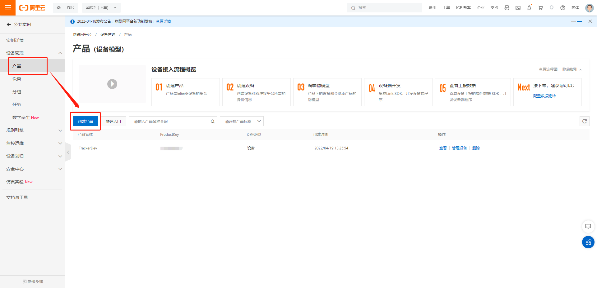
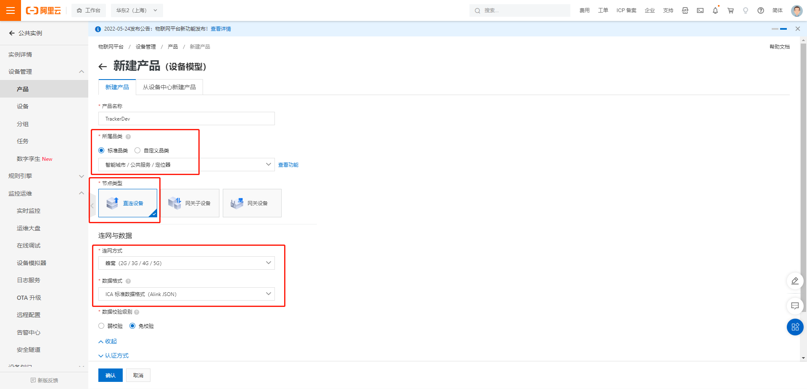
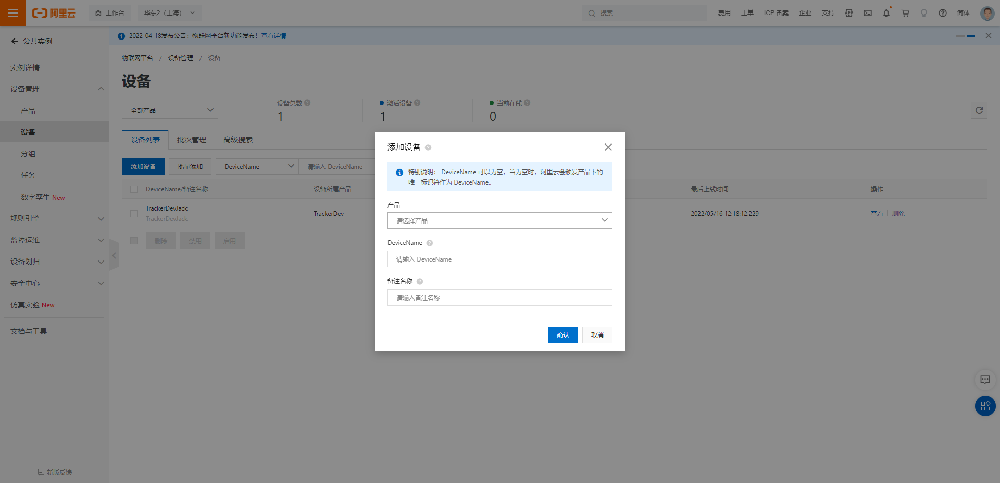

2. [为产品定义物模型](https://help.aliyun.com/document_detail/117636.html)

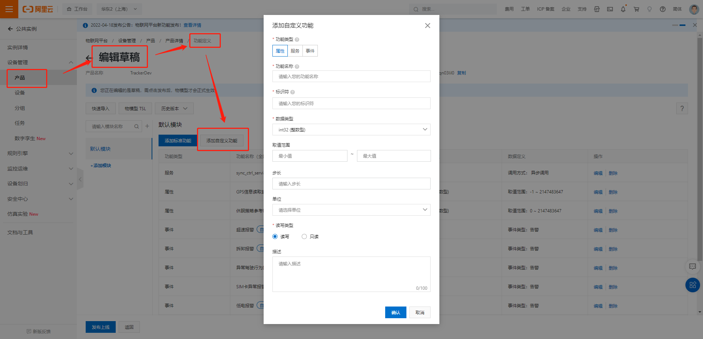

3. 项目提供了[物模型demo](https://gitee.com/qpy-solutions/tracker-v2/blob/dev/object_model_demo/ali_cloud_object_model.json), 可直接导入生成, 无需手动创建

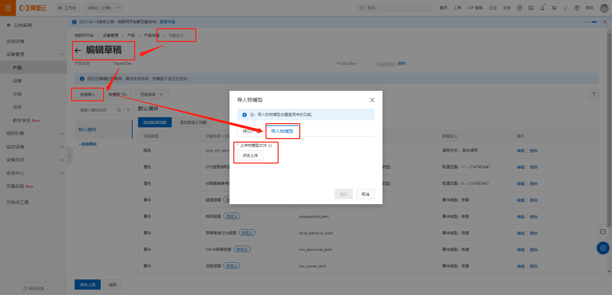

4. 导出JSON格式的精简模式物模型, 解压缩后得到物模型JSON文件, 重命名后, 放入项目根目录`code`下, 建议命名`aliyun_object_model.json`

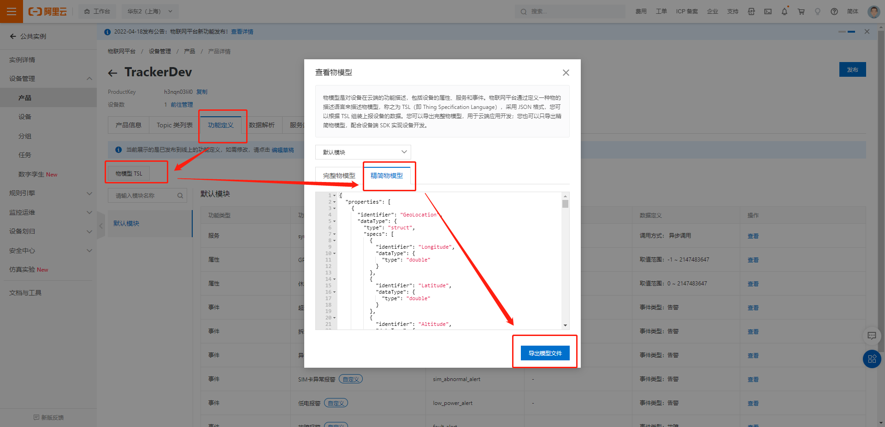

### 设置项目配置参数

#### 云端服务器配置(settings_cloud.py)

```python
# 阿里云连接配置参数
class AliCloudConfig:

    product_key = ""  # 产品KEY
    product_secret = ""  # 产品密钥
    device_name = ""  # 设备名称
    device_secret = ""  # 设备密钥
    server = "iot-as-mqtt.cn-shanghai.aliyuncs.com"  # 连接的服务器名称
    qos = 1  # 消息服务质量(0~1)


# ThingsBoard平台连接配置参数
class ThingsBoardConfig:

    host = ""  # 服务端IP
    port = 10021  # 服务端端口
    username = ""  # 用户名
    qos = 0  # 消息服务质量(0~1)
    client_id = ""  # 客户端id, 可使用设备IMEI号ͤ

```

#### 定位功能配置(settings_loc.py)

```python

profile_idx = 1  # PDP索引, ASR平台范围1-8, 展锐平台范围1-7

map_coordinate_system = _map_coordinate_system.WGS84  # 坐标系统WGS84 & 

gps_sleep_mode = _gps_sleep_mode.none  # GPS 休眠模式 0-无;1-pull off(关闭电源);2-backup;3-standby.

# 外置GPS UART串口读取配置参数
_gps_cfg = {
    "UARTn": UART.UART1,  # 串口号
    "buadrate": 115200,  # 波特率, 常用波特率都支持, 如4800、9600、19200、38400、57600、115200、230400等
    "databits": 8,  # 数据位（5 ~ 8）, 展锐平台当前仅支持8位
    "parity": 0,  # 奇偶校验（0 – NONE, 1 – EVEN, 2 - ODD）
    "stopbits": 1,  # 停止位（1 ~ 2）
    "flowctl": 0,  # 硬件控制流（0 – FC_NONE,  1 – FC_HW）
    "gps_mode": _gps_mode.external,  # 1-内置GPS, 2-外置GPS
    "nmea": 0b010111,  # NMEA明码语句校验项
    "PowerPin": None,  # 电源控制引脚号
    "StandbyPin": None,  # Standby低功耗模式引脚号(L76K)
    "BackupPin": None,  # Backup低功耗模式引脚号(L76K)
}

_cell_cfg = {
    "serverAddr": "www.queclocator.com",  # 服务器域名, 长度必须小于255 bytes
    "port": 80,  # 服务器端口, 目前仅支持 80 端口
    "token": "XXXX",  # 密钥, 16位字符组成, 需要申请
    "timeout": 3,  # 设置超时时间, 范围1-300s, 默认300s
    "profileIdx": profile_idx,  # PDP索引, ASR平台范围1-8, 展锐平台范围1-7
}

_wifi_cfg = {
    "token": "XXXX"  # 密钥, 16位字符组成, 需要申请
}
```

#### tracker业务相关配置(settings_user)

> 该模块配置参数为业务定义的物模型的参数与默认值, 用户可根据具体业务的物模型参数进行调整。

```python
debug = 1  # 是否开启debug日志

log_level = "DEBUG"  # 日志等级

checknet_timeout = 60  # 注网检测超时时间

cloud = _cloud.AliYun  # 云服务平台

phone_num = ""  # 设备内置电话号码

low_power_alert_threshold = 20  # 低电告警阈值

low_power_shutdown_threshold = 5  # 低电关机阈值

over_speed_threshold = 50  # 超速阈值

sw_ota = True  # 是否开启OTA升级

sw_ota_auto_upgrade = True  # 是否开启OTA自动升级

sw_voice_listen = False  # 是否开启语音监听功能

sw_voice_record = False  # 是否开启语音录音功能

sw_fault_alert = True  # 是否开启异常告警功能

sw_low_power_alert = True  # 是否开启低电告警功能

sw_over_speed_alert = True  # 是否开启超速告警功能

sw_sim_abnormal_alert = True  # 是否开启SIM卡异常告警功能

sw_disassemble_alert = True  # 是否开启拆卸告警功能

sw_drive_behavior_alert = True  # 是否开启异常驾驶行为告警功能

drive_behavior_code = _drive_behavior_code.none  # 异常驾驶行为编码

loc_method = LocConfig._loc_method.gps  # 定位方式

loc_gps_read_timeout = 300  # GPS定位信息读取超时时间

work_mode = _work_mode.cycle  # 设备工作模式: 周期性模式, 智能模式

work_mode_timeline = 3600  # 深度休眠与浅休眠时间分割点

work_cycle_period = 30  # 低功耗唤醒周期

user_ota_action = -1  # 用户确认是否OTA升级: 0-取消升级;1-确认升级

# OTA升级状态记录
ota_status = {
    "sys_current_version": "",  # 当前固件版本
    "sys_target_version": "--",  # 升级固件目标版本
    "app_current_version": "",  # 当前应用版本
    "app_target_version": "--",  # 升级应用目标版本
    "upgrade_module": _ota_upgrade_module.none,  # 升级模块: 0-无;1-固件;2-应用
    "upgrade_status": _ota_upgrade_status.none,  # 升级状态
}
```

## 开发工具

推荐使用[QPYcom](https://python.quectel.com/doc/doc/Advanced_development/zh/QuecPythonTools/QPYcom.html)作为项目的调试软件工具

下载地址: https://python.quectel.com/download

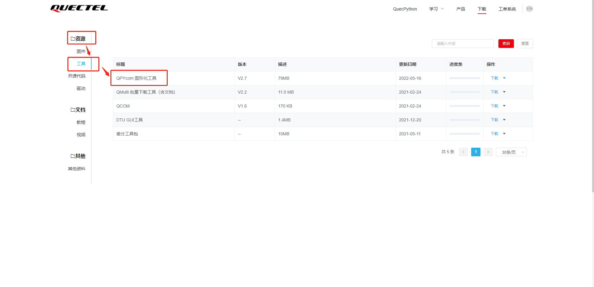

## 运行项目

1. 设置好模块的配置参数;
2. 将物模型JSON文件放入项目根目录中;
3. 开发主机安装好设备驱动与调试软件QPYcom;
4. 给设备安装SIM卡, 并连接主机启动电源;
5. 打开对应的设备串口, 将项目代码通过QPYcom烧录至设备中;

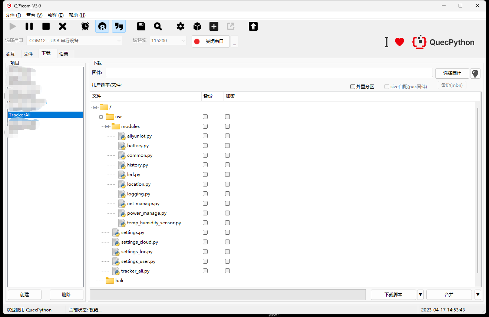

6. 通过交互页面即可查看项目运行状态.

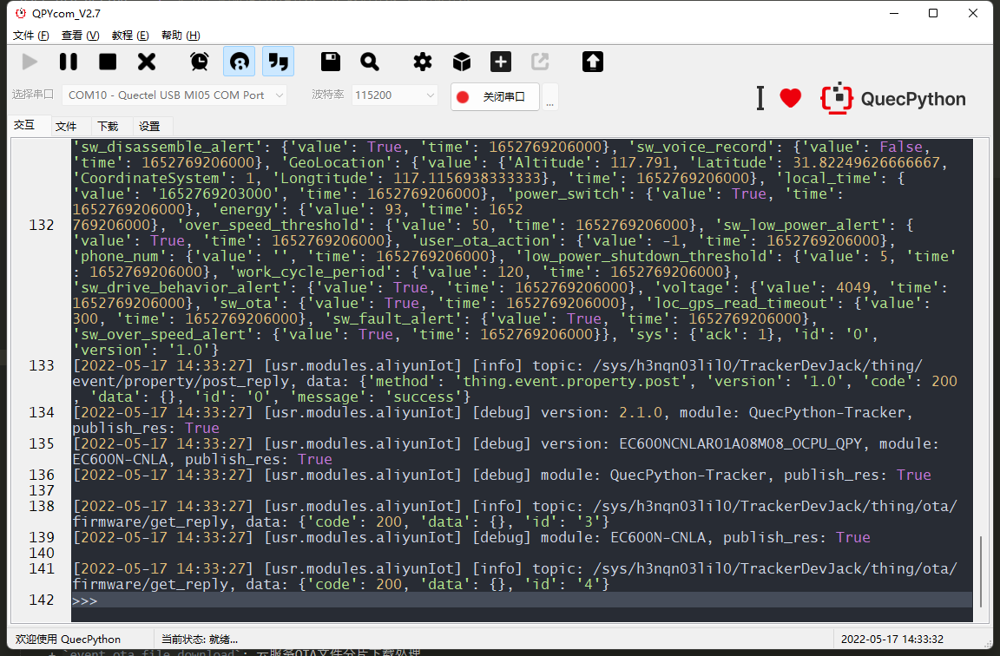

7. 在云服务SaaS平台查看设备状态信息.

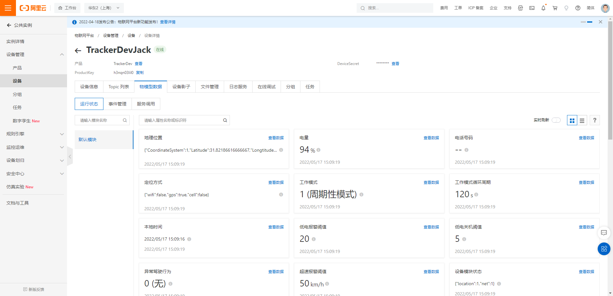

8. 可通过在线调试下发指令到设备端进行设备控制与数据交互.

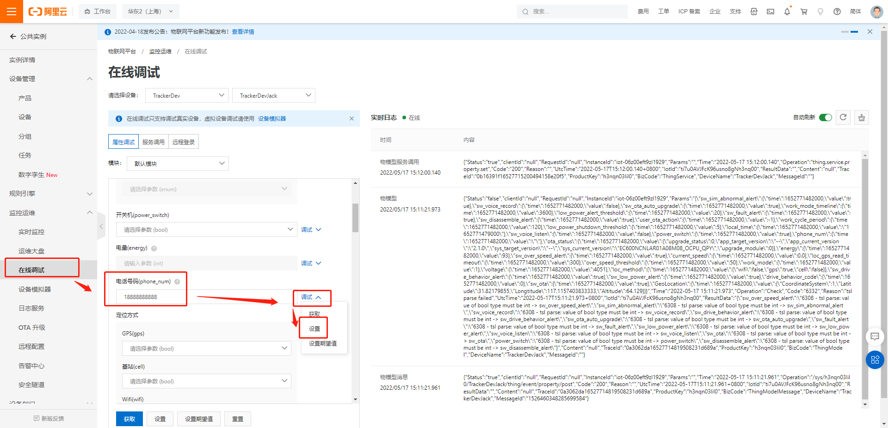

## OTA升级

> **固件升级只支持差分升级, 不支持整包升级**

### 阿里云

> **项目文件升级包, 以修改项目代码文件后缀名为`.bin`的方式做成升级包, 上传云端, 可上传多个文件**

#### 固件升级

1. 制作固件升级差分包(联系固件开发人员);
2. 创建OTA模块, 以设备平台名称命名, 如: `EC600N-CNLC`.


3. 创建OTA升级包

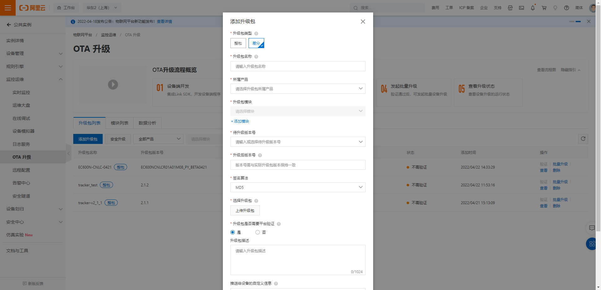

4. 选择批量升级, 创建升级计划

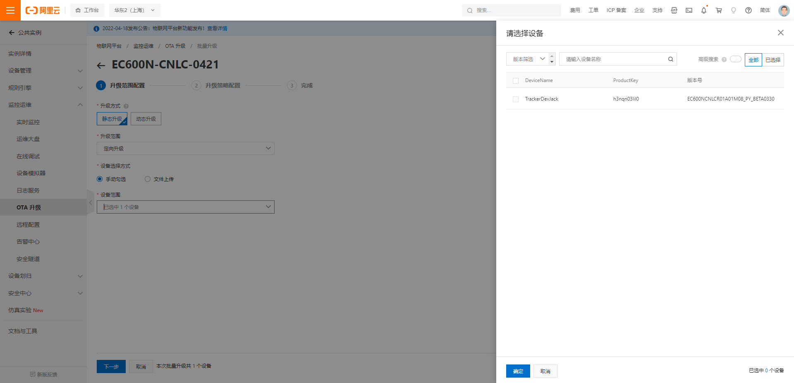

5. 等待设备升级, 查看升级结果

    + 当设备开启OTA升级和OTA自动升级, 则等待设备升级完成, 查看升级结果;
    + 当设备开启OTA升级, 但未开启自动升级时, 可通过在线调试模块下发`user_ota_action=1`的物模型设置指令, 进行OTA升级。

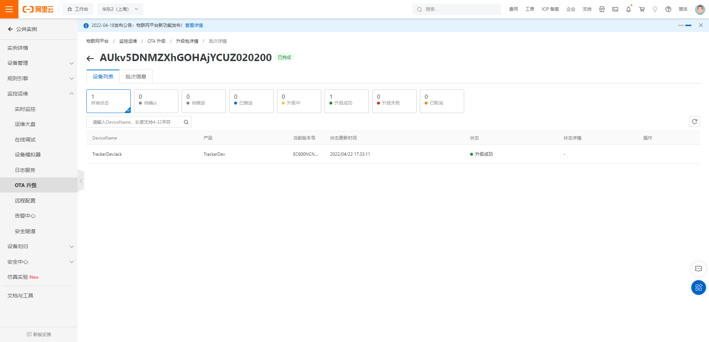

#### 项目升级

1. 创建OTA模块, 以`settings.py`中`PROJECT_NAME`命名, 如: `QuecPython-Tracker`.

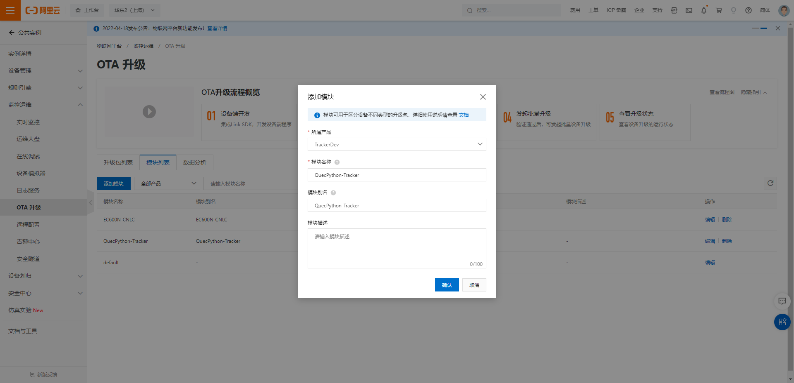

2. 将需要升级的项目文件后缀名修改为`.bin`
3. 创建OTA升级包
    + 此处需要在**推送给设备的自定义信息**中编写升级文件名对应的设备全路径文件名, 如: `{"files":{"common.bin":"/usr/modules/common.py","settings.bin":"/usr/settings.py","test_tracker.bin":"/usr/test_tracker.py"}}`

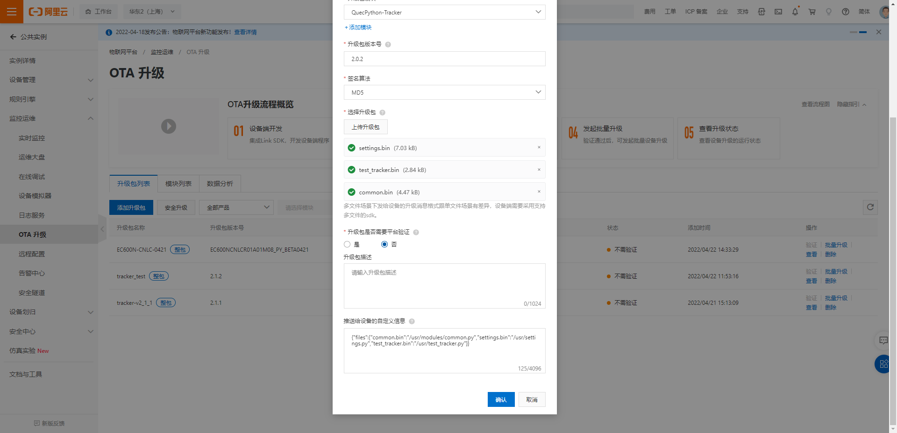

4. 选择批量升级, 创建升级计划


5. 等待设备升级, 查看升级结果

    + 当设备开启OTA升级和OTA自动升级, 则等待设备升级完成, 查看升级结果;
    + 当设备开启OTA升级, 但未开启自动升级时, 可通过在线调试模块下发`user_ota_action=1`的物模型设置指令, 进行OTA升级。

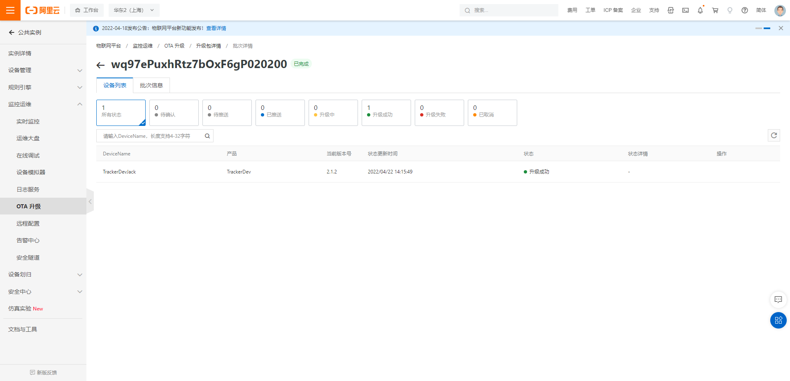

## 功能模块注册流程

### 功能注册说明流程图

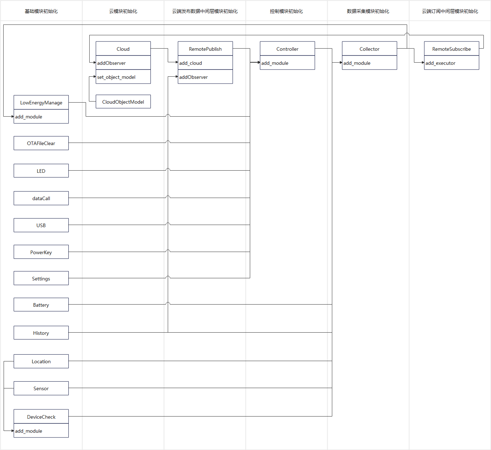

### 代码样例

```python
# 基础模块初始化
net_manage = NetManage(PROJECT_NAME, PROJECT_VERSION)
settings = Settings()
battery = Battery()
history = History()
cloud_cfg = settings.read("cloud")
cloud = AliYunIot(**cloud_cfg)
cloud_ota = AliYunOTA(PROJECT_NAME, FIRMWARE_NAME)
cloud_ota.set_cloud(cloud)
power_manage = PowerManage()
temp_sensor = TempHumiditySensor(i2cn=I2C.I2C1, mode=I2C.FAST_MODE)
loc_cfg = settings.read("loc")
gnss = GNSS(**loc_cfg["gps_cfg"])
cell = CellLocator(**loc_cfg["cell_cfg"])
wifi = WiFiLocator(**loc_cfg["wifi_cfg"])
nmea_parse = NMEAParse()
cyc = CoordinateSystemConvert()

# Tracker 功能模块初始化与基础功能模块注册
tracker = Tracker()
tracker.add_module(settings)
tracker.add_module(battery)
tracker.add_module(history)
tracker.add_module(net_manage)
tracker.add_module(cloud)
tracker.add_module(cloud_ota)
tracker.add_module(power_manage)
tracker.add_module(temp_sensor)
tracker.add_module(gnss)
tracker.add_module(cell)
tracker.add_module(wifi)
tracker.add_module(nmea_parse)
tracker.add_module(cyc)

# 网络与云服务客户端回调函数注册
net_manage.set_callback(tracker.net_callback)
cloud.set_callback(tracker.cloud_callback)

# 业务功能启动
tracker.running()
```

## 二次开发

1. 当用户使用阿里云或ThingsBoard平台, 可以直接根据实际业务, 修改`tracker_ali.py`或者`tracker_tb.py`。
2. 当用户使用新的服务端平台时, 可参考`aliyunIot.py`和`thingsboard.py`编写客户端代码。
3. `settings_cloud.py`为服务器客户端连接参数配置, 可在此处添加或者修改连接参数。
4. `settings_loc.py`为定位模块连接参数, 可在此处进行修改连接参数。

### 业务功能模块二次开发(`tracker_xxx.py` )

- `Tracker.add_module`为基础功能模块添加接口, 用于注册基础功能模块, 可根据实际业务情况进行调整需要注册的功能模块;
- `Tracker.running`为项目业务启动接口, 用于业务功能启动, 可根据实际情况进行编写启动业务功能;
- `Tracker.cloud_callback`为云端下发指令接收接口, 用于接收服务型下发的消息指令;
- `Tracker.net_callback`为网络状态变化接收接口, 当网络断开或者连接时, 可以通过该接口接收到网络的状态, 从而进行功能处理。
- 其他功能接口根据实际业务进行二次开发, 如:
    + `Tracker.__business_running`业务事件处理分发功能;
    + `Tracker.__get_device_infos`获取设备上报的数据信息;
    + `Tracker.__cloud_option`云端下发指令业务处理功能;

### 云服务连接配置文件(`settings_cloud.py`)

该模块为云服务连接配置文件, 用户可根据实际情况进行使用调整。

### 定位模块配置文件(`settings_loc.py`)

该模块为定位模块配置文件, 用户可根据实际情况进行GNSS模块相关信息配置, 基站定位与wifi定位的token配置。

### 用户业务功能配置文件(`settings_user.py`)

此处为用户的业务功能配置文件, 配置用户业务与项目相关配置参数。

## 简单demo样例

> 可参考[`tracker_tb.py`](../code/tracker_tb.py), 该模块提供了简单的周期性定位数据上报的样例。
