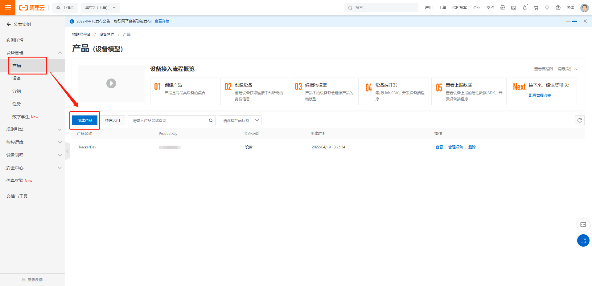
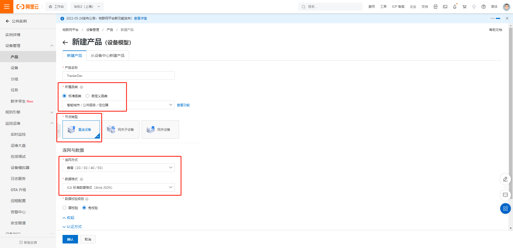
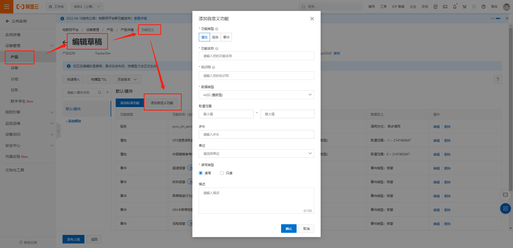
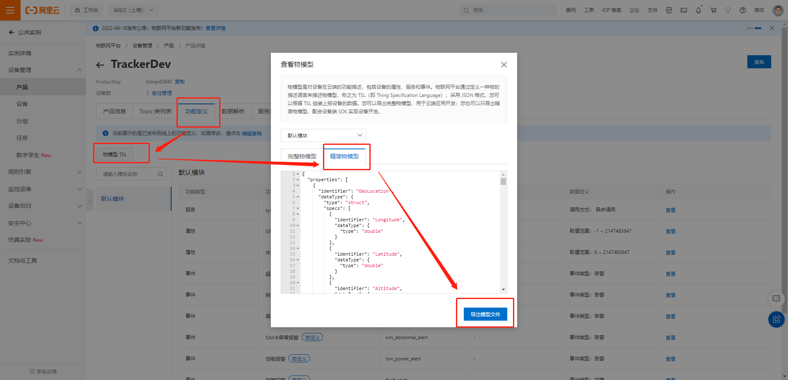
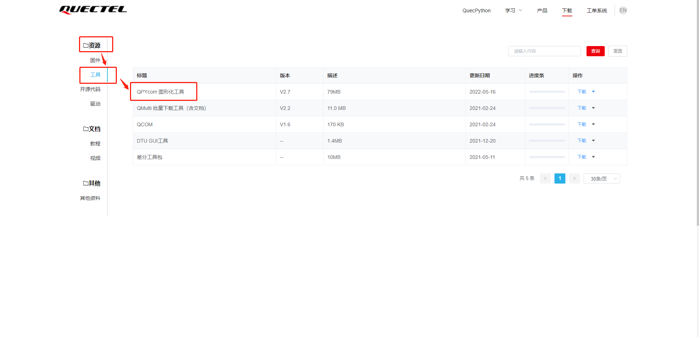
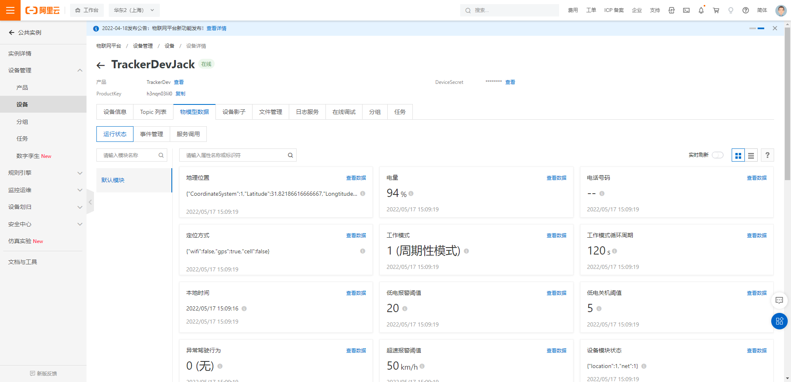
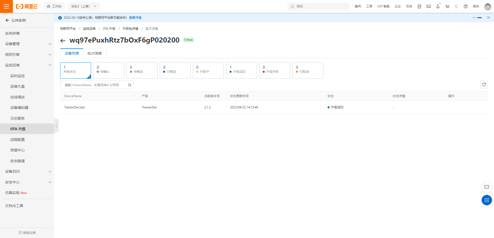

# Tracker 公版方案用户指导手册

## 项目简介

> 项目旨在为Python开发者提供一个Tracker项目的功能模板与组件，方便开发者快速开发Tracker嵌入式业务功能。

## 内置功能模块

- [x] 阿里云(aliyunIot): 提供阿里云物联网物模型的消息发布与订阅，OTA升级功能。
- [x] ThingsBoard(thingsboard): 提供ThingsBoard平台物联网物模型的消息发布与订阅，OTA升级功能。
- [x] 电池模块(battery): 提供设电池电量，电压数据查询，充电状态查询功能。
- [x] LED模块(led): 提供LED开关控制功能，周期性闪烁功能。
- [x] 定位模块(location): 提供内置/外置GPS，基站，WIFI定位查询功能。
- [x] 日志模块(logging): 提供日志打印功能。
- [x] 低功耗模块(mpower): 提供周期性低功耗唤醒功能。
- [x] 云服务中间件(remote): 提供云服务消息处理中间件功能。
- [x] 温湿度传感器(temp_humidity_sensor): 提供从温湿度传感器获取数据功能。
- [ ] 其他传感器功能(sensor): 开发中...

## 项目结构

```
|--code
    |--aliyun_object_model.json
    |--main.py
    |--settings.py
    |--settings_cloud.py
    |--settings_loc.py
    |--settings_user.py
    |--tracker_tb.py
    |--modules
        |--aliyunIot.py
        |--battery.py
        |--common.py
        |--history.py
        |--led.py
        |--location.py
        |--logging.py
        |--mpower.py
        |--remote.py
        |--temp_humidity_sensor.py
        |--sensor.py
        |--thingsboard.py
```

## 项目配置

### 硬件设备

推荐的硬件设备

- 内置GNSS设备: EC200UCNAA
- 外置GNSS设备: EC600NCNLA/EC600NCNLC

推荐外置GPS

- [LC86L](https://www.quectel.com/product/gnss-lc86l-series)
- [L76K](https://www.quectel.com/cn/product/gnss-l76k)

### 云服务平台

#### 阿里云

1. [创建产品与设备](https://help.aliyun.com/document_detail/73705.html)





2. [为产品定义物模型](https://help.aliyun.com/document_detail/117636.html)



3. 项目提供了[物模型demo](https://gitee.com/qpy-solutions/tracker-v2/blob/dev/object_model_demo/ali_cloud_object_model.json), 可直接导入生成，无需手动创建


4. 导出JSON格式的精简模式物模型, 解压缩后得到物模型JSON文件, 重命名后, 放入项目根目录`code`下, 建议命名`aliyun_object_model.json`



### 设置项目配置参数

#### 项目基础配置(settings_sys)

```python
debug = True  # 是否开启debug日志
log_level = "DEBUG"  # 日志等级
cloud = _cloud.AliYun  # 设置云服务平台
checknet_timeout = 60  # 网络检测超时时间
base_cfg = {
    "LocConfig": True,  # 是否启用定位模块
}
user_cfg = True  # 是否启用用户配置模块
```

#### 阿里云配置(settings_alicoud)

```python
PK = "{ProductKey}"  # 产品KEY
PS = "{ProductSecret}"  # 产品密钥
DK = "{DeviceName}"  # 设备名称
DS = "{DeviceSecret}"  # 设备密钥

SERVER = "%s.iot-as-mqtt.cn-shanghai.aliyuncs.com" % PK  # 连接的服务器名称
client_id = ""  # 自定义阿里云连接id
life_time = 120  # 通信之间允许的最长时间段(以秒为单位), 范围(60-1200)
burning_method = _burning_method.one_machine_one_secret  # 一机一密，一型一密
```

#### 定位功能配置(settings_loc)

```python

profile_idx = 1  # PDP索引，ASR平台范围1-8，展锐平台范围1-7

# 外置GPS UART串口读取配置参数
_gps_cfg = {
    "UARTn": UART.UART1,  # 串口号
    "buadrate": 115200,  # 波特率，常用波特率都支持，如4800、9600、19200、38400、57600、115200、230400等
    "databits": 8,  # 数据位（5 ~ 8），展锐平台当前仅支持8位
    "parity": 0,  # 奇偶校验（0 – NONE，1 – EVEN，2 - ODD）
    "stopbits": 1,  # 停止位（1 ~ 2）
    "flowctl": 0,  # 硬件控制流（0 – FC_NONE， 1 – FC_HW）
    "PowerPin": None,  # 电源控制引脚号
    "StandbyPin": None,  # Standby低功耗模式引脚号(L76K)
    "BackupPin": None  # Backup低功耗模式引脚号(L76K)
}

_cell_cfg = {
    "serverAddr": "www.queclocator.com",  # 服务器域名，长度必须小于255 bytes
    "port": 80,  # 服务器端口，目前仅支持 80 端口
    "token": "XXXX",  # 密钥，16位字符组成，需要申请
    "timeout": 3,  # 设置超时时间，范围1-300s，默认300s
    "profileIdx": profile_idx,  # PDP索引，ASR平台范围1-8，展锐平台范围1-7
}

_wifi_cfg = {
    "token": "XXXX"  # 密钥，16位字符组成，需要申请
}

gps_mode = _gps_mode.external  # 1-内置GPS, 2-外置GPS

loc_method = _loc_method.gps  # 定位方式, 1-GPS;2-CELL;3-GPS&CELL;4-WIFI;5-GPS&WIFI;6-CELL&WIFI;7-GPS&CELL&WIFI

map_coordinate_system = _map_coordinate_system.WGS84  # 坐标系统WGS84 & 

gps_sleep_mode = _gps_sleep_mode.none  # GPS 休眠模式 0-无;1-pull off(关闭电源);2-backup;3-standby.

```

#### tracker业务相关配置(settings_user)

> 该模块配置参数为业务定义的物模型的参数与默认值，用户可根据具体业务的物模型参数进行调整。

```python
phone_num = ""  # 设备内置电话号码

low_power_alert_threshold = 20  # 低电告警阈值

low_power_shutdown_threshold = 5  # 低电关机阈值

over_speed_threshold = 50  # 超速阈值

sw_ota = True  # 是否开启OTA升级

sw_ota_auto_upgrade = True  # 是否开启OTA自动升级

sw_voice_listen = False  # 是否开启语音监听功能

sw_voice_record = False  # 是否开启语音录音功能

sw_fault_alert = True  # 是否开启异常告警功能

sw_low_power_alert = True  # 是否开启低电告警功能

sw_over_speed_alert = True  # 是否开启超速告警功能

sw_sim_abnormal_alert = True  # 是否开启SIM卡异常告警功能

sw_disassemble_alert = True  # 是否开启拆卸告警功能

sw_drive_behavior_alert = True  # 是否开启异常驾驶行为告警功能

drive_behavior_code = _drive_behavior_code.none  # 异常驾驶行为编码

loc_method = LocConfig._loc_method.gps  # 定位方式

loc_gps_read_timeout = 300  # GPS定位信息读取超时时间

work_mode = _work_mode.cycle  # 设备工作模式: 周期性模式，智能模式

work_mode_timeline = 3600  # 深度休眠与浅休眠时间分割点

work_cycle_period = 30  # 低功耗唤醒周期

user_ota_action = -1  # 用户确认是否OTA升级: 0-取消升级;1-确认升级

# OTA升级状态记录
ota_status = {
    "sys_current_version": "",  # 当前固件版本
    "sys_target_version": "--",  # 升级固件目标版本
    "app_current_version": "",  # 当前应用版本
    "app_target_version": "--",  # 升级应用目标版本
    "upgrade_module": _ota_upgrade_module.none,  # 升级模块: 0-无;1-固件;2-应用
    "upgrade_status": _ota_upgrade_status.none,  # 升级状态
}
```

## 开发工具

推荐使用[QPYcom](https://python.quectel.com/doc/doc/Advanced_development/zh/QuecPythonTools/QPYcom.html)作为项目的调试软件工具

下载地址: https://python.quectel.com/download



## 运行项目

1. 设置好模块的配置参数;
2. 将物模型JSON文件放入项目根目录中;
3. 开发主机安装好设备驱动与调试软件QPYcom;
4. 给设备安装SIM卡，并连接主机启动电源;
5. 打开对应的设备串口，将项目代码通过QPYcom烧录至设备中;


6. 通过交互页面即可查看项目运行状态.


7. 在云服务SaaS平台查看设备状态信息.



8. 可通过在线调试下发指令到设备端进行设备控制与数据交互.


## OTA升级

> **固件升级只支持差分升级，不支持整包升级**

### 阿里云

> **项目文件升级包，以修改项目代码文件后缀名为`.bin`的方式做成升级包，上传云端，可上传多个文件**

#### 固件升级

1. 制作固件升级差分包(联系固件开发人员);
2. 创建OTA模块，以设备平台名称命名，如: `EC600N-CNLC`.


3. 创建OTA升级包


4. 选择批量升级, 创建升级计划


5. 等待设备升级，查看升级结果

    + 当设备开启OTA升级和OTA自动升级，则等待设备升级完成，查看升级结果;
    + 当设备开启OTA升级，但未开启自动升级时，可通过在线调试模块下发`user_ota_action=1`的物模型设置指令，进行OTA升级。


#### 项目升级

1. 创建OTA模块，以`settings.py`中`PROJECT_NAME`命名，如: `QuecPython-Tracker`.


2. 将需要升级的项目文件后缀名修改为`.bin`
3. 创建OTA升级包
    + 此处需要在**推送给设备的自定义信息**中编写升级文件名对应的设备全路径文件名, 如: `{"files":{"common.bin":"/usr/modules/common.py","settings.bin":"/usr/settings.py","test_tracker.bin":"/usr/test_tracker.py"}}`


4. 选择批量升级, 创建升级计划


5. 等待设备升级，查看升级结果

    + 当设备开启OTA升级和OTA自动升级，则等待设备升级完成，查看升级结果;
    + 当设备开启OTA升级，但未开启自动升级时，可通过在线调试模块下发`user_ota_action=1`的物模型设置指令，进行OTA升级。



## 功能模块注册流程

### 功能注册说明流程图


### 代码样例

```python
### 基础模块初始化 ###
current_settings = settings.get()
energy_led = LED()
running_led = LED()
sensor = Sensor()
history = History()
battery = Battery()
low_energy = LowEnergyManage()
work_cycle_period = current_settings["user_cfg"]["work_cycle_period"]
low_energy.set_period(work_cycle_period)
low_energy.set_low_energy_method(collector.__init_low_energy_method(work_cycle_period))
data_call = dataCall
usb = USB() if USB is not None else None
power_key = PowerKey() if PowerKey is not None else None
locator = Location(current_settings["LocConfig"]["gps_mode"], current_settings["LocConfig"]["locator_init_params"])
# DeviceCheck initialization
devicecheck = DeviceCheck()
# Add Location to DeviceCheck for checking whether locate is normal or not.
devicecheck.add_module(locator)
# Add Sensor to DeviceCheck for checking whether the sensor is normal or not.
devicecheck.add_module(sensor)

### 云模块初始化 ###
cloud_init_params = current_settings["cloud"]
if current_settings["sys"]["cloud"] & SYSConfig._cloud.AliYun:
    client_id = cloud_init_params["client_id"] if cloud_init_params.get("client_id") else modem.getDevImei()
    cloud = AliYunIot(
        cloud_init_params["PK"],
        cloud_init_params["PS"],
        cloud_init_params["DK"],
        cloud_init_params["DS"],
        cloud_init_params["SERVER"],
        client_id,
        burning_method=cloud_init_params["burning_method"],
        mcu_name=PROJECT_NAME,
        mcu_version=PROJECT_VERSION,
        firmware_name=DEVICE_FIRMWARE_NAME,
        firmware_version=DEVICE_FIRMWARE_VERSION
    )
    # Cloud object model init
    cloud_om = AliObjectModel()
    cloud.set_object_model(cloud_om)
else:
    raise TypeError("Settings cloud[%s] is not support." % current_settings["sys"]["cloud"])

### 云端发布数据中间层模块初始化 ###
# RemotePublish initialization
remote_pub = RemotePublish()
# Add History to RemotePublish for recording failure data
remote_pub.addObserver(history)
# Add Cloud to RemotePublish for publishing data to cloud
remote_pub.add_cloud(cloud)

### 控制模块初始化 ###
# Controller initialization
controller = Controller()
# Add RemotePublish to Controller for publishing data to cloud
controller.add_module(remote_pub)
# Add Settings to Controller for changing settings.
controller.add_module(settings)
# Add LowEnergyManage to Controller for controlling low energy.
controller.add_module(low_energy)
# Add LED to Controller for show device status.
controller.add_module(energy_led, led_type="energy")
controller.add_module(running_led, led_type="running")
# Add power_key to Controller for power key callback
controller.add_module(power_key, callback=pwk_callback)
# Add USB to Controller for get usb status
controller.add_module(usb, callback=usb_callback)
# Add dataCall to Controller for get net error callback
controller.add_module(data_call)

### 数据采集模块初始化 ###
# Collector initialization
collector = Collector()
# Add Controller to Collector for puting command to control device.
collector.add_module(controller)
# Add DeviceCheck to Collector for getting device status.
collector.add_module(devicecheck)
# Add Battery to Collector for getting battery info.
collector.add_module(battery)
# Add Sensor to Collector for getting sensor info.
collector.add_module(sensor)
# Add Location to Collector for getting location info.
collector.add_module(locator)
# Add History to Collector for getting history data.
collector.add_module(history)
# LowEnergyManage initialization
low_energy.addObserver(collector)

### 云端订阅中间层模块初始化 ###
# RemoteSubscribe initialization
remote_sub = RemoteSubscribe()
remote_sub.add_executor(collector)
cloud.addObserver(remote_sub)

### 启动Tracker功能 ###
# Business start
# Cloud start
cloud.init()
# OTA status init
collector.ota_status_init()
# Device modules status check
collector.device_status_check()
# Device info report to cloud
controller.remote_device_report()
# OTA plain check
controller.remote_ota_check()
# Low energy init
controller.low_energy_init()
# Low energy start
controller.low_energy_start()
```

## 二次开发

当使用自定义物模型时，需重写`tracker_collector.py`, `settings_user.py`两个文件

### 数据采集器修改(`tracker_collector.py` )

- 用户可继承或修改`Collector`类进二次开发
- 以下基础功能方法，不可删除，用户可根据实际业务需求修改函数内处理逻辑
    + `add_module`: 添加功能模块
    + `event_option`: 云服务透传数据处理
    + `event_done`: 云服务物模型设置数据处理
    + `event_query`: 云服务物模型查询数据处理
    + `event_ota_plain`: 云服务OTA升级计划处理
    + `event_ota_file_download`: 云服务OTA文件分片下载处理
    + `low_engery_option`: 低功耗周期唤醒业务处理
    + `update`: 接收被监听者消息通知功能
- 用户可新增其他方法用于业务处理

### 业务配置文件(`settings_user.py`)

该模块为业务配置文件，用户可根据实际情况进行使用调整。

### DEMO样例

周期性上传定位信息到云端

```python
from usr.settings import PROJECT_NAME, PROJECT_VERSION, \
    DEVICE_FIRMWARE_NAME, DEVICE_FIRMWARE_VERSION, settings, SYSConfig
from usr.tracker_collector import Collector
from usr.tracker_controller import Controller

from usr.modules.history import History
from usr.modules.location import Location
from usr.modules.mpower import LowEnergyManage
from usr.modules.remote import RemotePublish, RemoteSubscribe
from usr.modules.aliyunIot import AliYunIot, AliObjectModel
from usr.modules.quecthing import QuecThing, QuecObjectModel


def TestCollector(Collector):

    def loc_report(self):
        # Get cloud location data
        loc_info = self.__read_location()
        cloud_loc = self.__read_cloud_location(loc_info)
        return self.__controller.remote_post_data(device_data)

    def low_engery_option(self, low_energy_method):
        """Business option after low energy waking up."""
        if not self.__controller:
            raise TypeError("self.__controller is not registered.")

        self.loc_report()

        if low_energy_method == "POWERDOWN":
            self.__controller.power_down()


### 基础模块初始化 ###
current_settings = settings.get()
# 初始化历史文件存储模块
history = History()
# 初始化低功耗模块
low_energy = LowEnergyManage()
# 初始化低功耗模块
work_cycle_period = current_settings["user_cfg"]["work_cycle_period"]
# 设置低功耗唤醒周期
low_energy.set_period(work_cycle_period)
# 根据低功耗唤醒周期和设备选择低功耗模式
low_energy.set_low_energy_method(collector.__init_low_energy_method(work_cycle_period))
# 初始化定位模块
locator = Location(current_settings["LocConfig"]["gps_mode"], current_settings["LocConfig"]["locator_init_params"])

### 云模块初始化 ###
cloud_init_params = current_settings["cloud"]
if current_settings["sys"]["cloud"] & SYSConfig._cloud.AliYun:
    client_id = cloud_init_params["client_id"] if cloud_init_params.get("client_id") else modem.getDevImei()
    # 初始化阿里云服务模块
    cloud = AliYunIot(
        cloud_init_params["PK"],
        cloud_init_params["PS"],
        cloud_init_params["DK"],
        cloud_init_params["DS"],
        cloud_init_params["SERVER"],
        client_id,
        burning_method=cloud_init_params["burning_method"],
        mcu_name=PROJECT_NAME,
        mcu_version=PROJECT_VERSION,
        firmware_name=DEVICE_FIRMWARE_NAME,
        firmware_version=DEVICE_FIRMWARE_VERSION
    )
    # 转化物模型json为对象
    cloud_om = AliObjectModel()
    # 将物模型实例对象注册到云服务对象中
    cloud.set_object_model(cloud_om)
else:
    raise TypeError("Settings cloud[%s] is not support." % current_settings["sys"]["cloud"])

### 云端发布数据中间层模块初始化 ###
# 初始化云服务发布消息中间件
remote_pub = RemotePublish()
# 添加历史文件模块到云服务发布消息中间件中，当发送失败时将数据存入历史文件中
remote_pub.addObserver(history)
# 添加云服务模块到云服务发布消息中间件中，用于消息的发布
remote_pub.add_cloud(cloud)

### 控制模块初始化 ###
# 初始化控制模块
controller = Controller()
# 添加云服务发布消息中间件到控制模块
controller.add_module(remote_pub)
# 添加低功耗模块到控制模块中
controller.add_module(low_energy)

### 数据采集模块初始化 ###
# 初始化数据采集模块
collector = TestCollector()
# 添加控制模块到数据采集模块，用于控制设备模块与发送数据
collector.add_module(controller)
# 添加定位模块到数据采集模块，用于查询定位信息.
collector.add_module(locator)
# 添加数据采集者作为低功耗模块的监听者，接收唤醒消息
low_energy.addObserver(collector)

### 云端订阅中间层模块初始化 ###
# 初始化云服务消息订阅中间件
remote_sub = RemoteSubscribe()
# 添加数据采集这作为云服务消息订阅中间件的监听者，接收云端下发的消息指令
remote_sub.add_executor(collector)
# 云服务模块添加云服务消息订阅中间件作为云服务模块的监听者，接收云端下发的消息指令
cloud.addObserver(remote_sub)

### 启动Tracker功能 ###
# 云服务初始化连接
cloud.init()
# 上报定位信息
collector.loc_report()
# 低功耗休眠初始化
controller.low_energy_init()
# 启动低功耗休眠
controller.low_energy_start()

```
