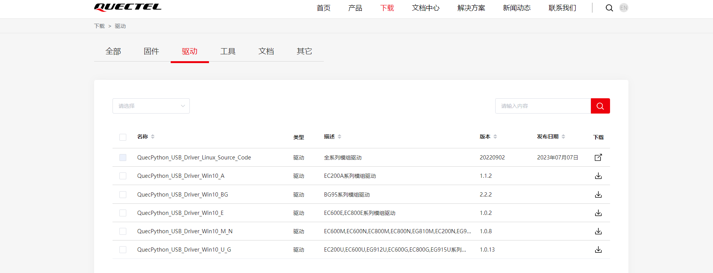
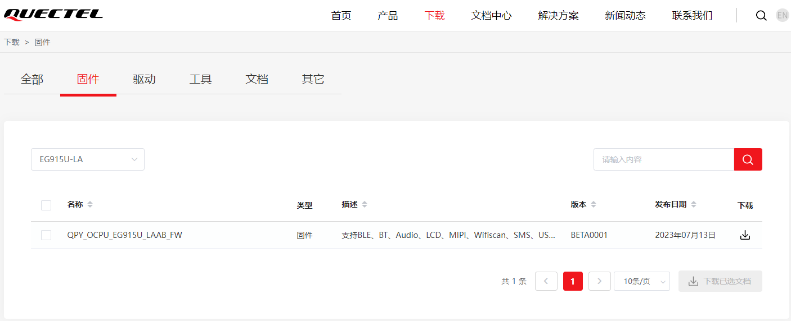
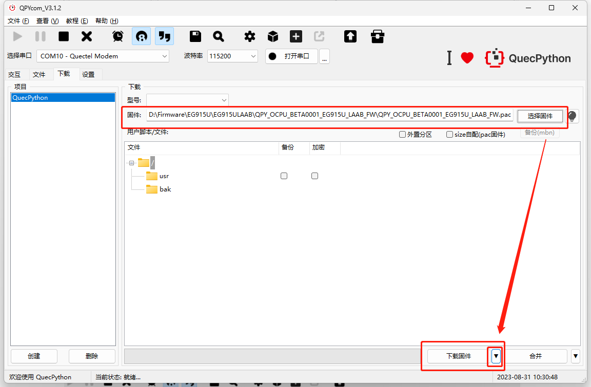
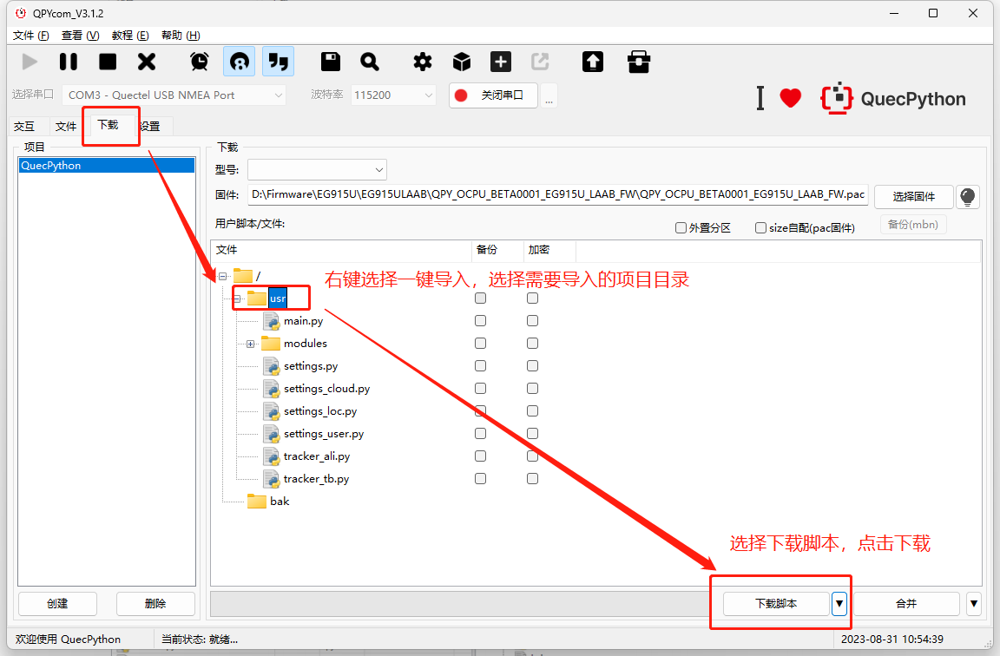
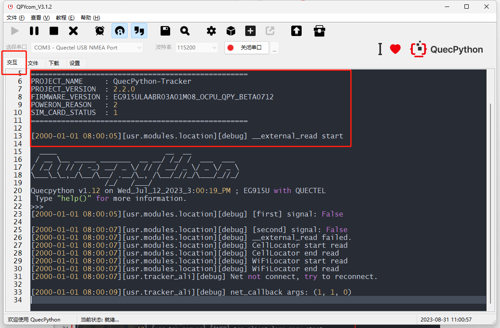

**中文** | [English](../en/Tracker%20solution%20implementation%20guide.md) |

# 定位器方案应用指导

## 引言

本文档用于介绍如何在模组或设备上运行我们提供的定位器方案程序, 当前文档操作基于EG915U型号模组进行展示。

## 方案资源获取

定位器解决方案资源下载地址: https://github.com/QuecPython/solution-tracker

> 该方案项目有一个`modules`子仓库, 在下载时需要注意同步下载
>
> 子仓库同步下载指令`git clone --recursive https://github.com/QuecPython/solution-tracker.git`

资源包目录展示:


- code 文件夹:

该目录下包含软件方案代码


- docs 文件夹:

该目录下包含用户指导手册与功能接口说明的项目文档


- object_model_demo 文件夹:

该目录下提供了一个阿里Iot平台的物模型文件, 可以直接导入阿里Iot平台, 方便调试

## 方案说明

此方案为定位器公版方案, 不包含全部业务功能, 方案提供定位器业务核心组件的功能实现以及与服务端完成数据交互, 事件转发等功能, 使用者应基于此框架继续开发业务功能, 当前软件框架完成功能如下:

- MQTT协议通讯（当前方案支持阿里Iot平台/ThingsBoard平台）
- 配置文件读写
- OTA远程升级
- LED指示灯
- 设备网络管理
- 设备信息管理
- 电池电量与充电管理
- 备份信息存储
- GNSS定位/基站定位/Wifi定位
- 低功耗管理
- 日志存储记录

## 环境搭建

### USB驱动安装

请根据调试模组平台进行驱动下载安装, [点击此处下载](https://python.quectel.com/download)



### 开发调试工具

推荐使用QPYcom进行开发调试, 此文档中的流程介绍均使用该工具进行, 且成功安装USB驱动

工具下载链接: [点击此处下载](https://python.quectel.com/download)


工具使用说明: [点击此处访问](https://python.quectel.com/doc/Application_guide/en/dev-tools/QPYcom/qpycom-gui.html)

### 代码配置参数修改

目前方案代码使用的配置参数未进行配置, 请按照下面说明进行更改。

找到code中的以`settings_`开头的配置文件进行配置, 根据实际参数进行调整, 如下图:

- `settings_server.py` 用于配置连接的 IoT 平台连接信息

```python
class AliIotConfig:

    product_key = ""
    product_secret = ""
    device_name = ""
    device_secret = ""
    server = "iot-as-mqtt.cn-shanghai.aliyuncs.com"
    qos = 1


class ThingsBoardConfig:

    host = ""
    port = 1883
    username = ""
    qos = 0
    client_id = ""
```

- `settings_loc.py` 用于配置定位模块的配置信息(外挂GNSS串口, 基站/Wifi定位的认证信息)

```python
gps_cfg = {
    "UARTn": UART.UART1,
    "buadrate": 115200,
    "databits": 8,
    "parity": 0,
    "stopbits": 1,
    "flowctl": 0,
    "gps_mode": _gps_mode.external,
    "nmea": 0b010111,
    "PowerPin": None,
    "StandbyPin": None,
    "BackupPin": None,
}

cell_cfg = {
    "serverAddr": "www.queclocator.com",
    "port": 80,
    "token": "xxxxxxxxxx",
    "timeout": 3,
    "profileIdx": profile_idx,
}

wifi_cfg = {
    "token": "xxxxxxxxxx"
}
```

- `settings_user.py` 用于配置用户业务功能的相关配置参数(如报警开关, 低电阈值等)

```python
class _server:
    none = 0x0
    AliIot = 0x1
    ThingsBoard = 0x2

class _drive_behavior_code:
    none = 0x0
    sharply_start = 0x1
    sharply_stop = 0x2
    sharply_turn_left = 0x3
    sharply_turn_right = 0x4

class _ota_upgrade_module:
    none = 0x0
    sys = 0x1
    app = 0x2

debug = 1
log_level = "DEBUG"
checknet_timeout = 60
server = _server.AliIot
phone_num = ""
low_power_alert_threshold = 20
low_power_shutdown_threshold = 5
over_speed_threshold = 50
sw_ota = 1
sw_ota_auto_upgrade = 1
sw_voice_listen = 0
sw_voice_record = 0
sw_fault_alert = 1
sw_low_power_alert = 1
sw_over_speed_alert = 1
sw_sim_abnormal_alert = 1
sw_disassemble_alert = 1
sw_drive_behavior_alert = 1
drive_behavior_code = _drive_behavior_code.none
loc_method = _loc_method.all
loc_gps_read_timeout = 300
work_mode = _work_mode.cycle
work_mode_timeline = 3600
work_cycle_period = 30
user_ota_action = -1
ota_status = {
    "sys_current_version": "",
    "sys_target_version": "--",
    "app_current_version": "",
    "app_target_version": "--",
    "upgrade_module": _ota_upgrade_module.none,
    "upgrade_status": _ota_upgrade_status.none,
}
```

### 烧录固件

根据当前调试模组型号下载对应QuecPython固件, 并使用Qpycom工具进行烧录

固件下载地址: [点击此处访问](https://python.quectel.com/download)



使用QPYcom工具下载固件

1. 选择固件


2. 下载固件



3. 等待固件烧录


4. 烧录成功


5. 连接交互口


6. 查看烧录信息


### 烧录代码

- 建议在下载代码前将文件中的`main.py`重命名为`_main.py`, 因为`main.py`会上电自运行, 不方便调试, 我们测试阶段可以手动执行`_main.py`来运行, 方便调试问题

- 通过USB下载代码需要设备预留USB接口或测试点, 或使用开发板进行调试, 并提前安装好驱动

1. 选择`Quectel USB NMEA PORT`, 该串口为交互口, 程序LOG也会通过该串口输出


2. 将业务功能代码批量烧录设备, 点击下载脚本后等待下载完成, 下载完成后在文件中查看



3. 烧录成功后建议重启设备, 然后运行功能(如烧录了`main.py`, 则重启设备后, 功能会自动运行, 如已将`main.py`重命名后烧录, 则需手动运行`_main.py`启动功能)


4. 运行结果展示


