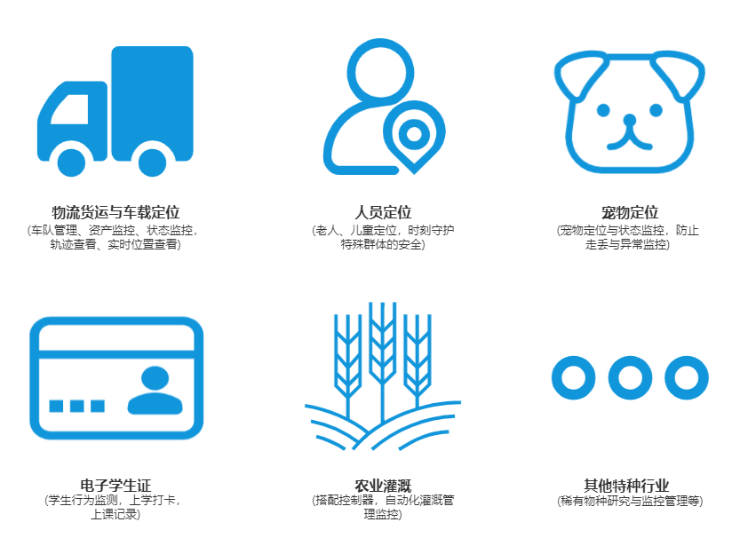
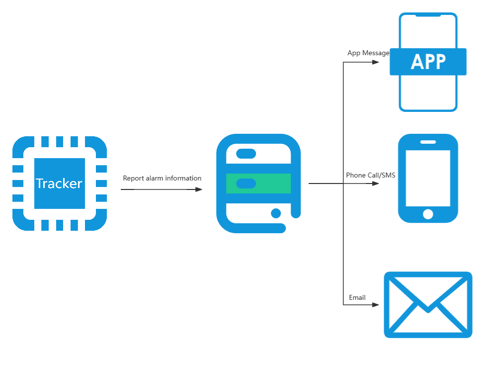

# Smart Tracker Solution for QuecPython

## Tracker Introduction

### Product Overview

- **Tracker**: An intelligent tracking device.
- **Comprehensive Functionality**: Covers a wide range of tracker application scenarios.
- **Visual Platform + Mobile App**: Enhances device management and data visualization.


### Product Functions
- **Multi-Mode Positioning**: Includes safety zones, danger alerts, emergency calls, voice monitoring, recording, playback, and remote control.
- **Smart Positioning System**: Leverages 4G communication, multi-mode positioning, and cloud technology for an all-in-one solution in the tracker industry.
- **Full Platform Compatibility**: A fully featured device operation platform and mobile app, enabling device manufacturers to skip building their own cloud infrastructure.
- **Rugged Reliability**: Offers high-precision location, sensitive danger detection, low power consumption, and stable operation, facilitating rapid hardware adoption with ready-made enclosures.


### Product Features
- Intelligent recognition and reporting of location data and hazardous situations.
- Supports integration with various cloud platforms, including QuecCloud, AliCloud, and Tencent Cloud.
- Second-Stage Development: Allows modular and tailored development, reducing development timelines.
- Terminal control through a visual platform and mobile app.

### Application Industries
- Vehicle Tracking
- Logistics and Freight
- Personnel Localization
- Electronic Student IDs
- Pet Tracking
- Specialized Sectors (like agricultural irrigation and rare species monitoring)



## QuecTracker Capabilities

### Product Capabilities
- **Multi-Cloud Integration**: Works with Alibaba Cloud, Tencent Cloud, and ThingsBoard (currently ThingsBoard only, others in progress).
- **Local and Remote Configuration**.
- **OTA Upgrades**.
- **Offline Data Handling**:
  - Stores data locally during network outages and sends it upon recovery.
  - Adjustable local storage capacity.
- **Sensor and Input Device Support**:
  - Sensors: Light, 3-axis accelerometer, temperature & humidity, etc.
  - Inputs: Microphone, etc.
- **QuecPython Enablement**: Secondary development empowered by Python scripting.

### Ancillary Tools

#### QPYcom Utility

QPYcom is a versatile tool that combines **QuecPython interactive shell, file transfers between PC and module, firmware image creation, packaging, and flashing**.

For second-stage development, QPYcom boosts efficiency.

[Download QPYCom here.](https://python.quectel.com/download)
Consult the `docs` folder in the installation directory for QPYCom usage instructions.


### Product Advantages
- **GNSS Support**: Accurate global positioning with GPS, BDS, GLONASS, Galileo, Wi-Fi, and cell tower assistance.
- **1000mAh Battery**: Ultra-low power draw, extended stand-by time over 8000 days.
- **Sensor Suite**: Accelerometers, temperature & humidity sensors, and more for versatile applications.
- **Wide Voltage Input**: Operates from 9V to 108V, suitable for various vehicles.
- **Swift Position Acquisition**: AGPS-assisted fast positioning.
- **Covert Installation**: Magnetically attachable, adhesive, or fixed, for stealth tracking.
- **Cost-effective Development**: Python-based customization reduces software costs.
- **Interchangeable Module Support**: Python development works across multiple modules with minimal code changes.
- **Exceptional Customer and Tech Support**.

## QuecTracker Workflow

### Danger Alerts and Emergency Help



### Remote Control


## Retrieving the Code

The project includes a `modules` subproject which must be cloned alongside the main project.

```bash
git clone --recurse-submodules https://github.com/QuecPython/solution-tracker.git
```