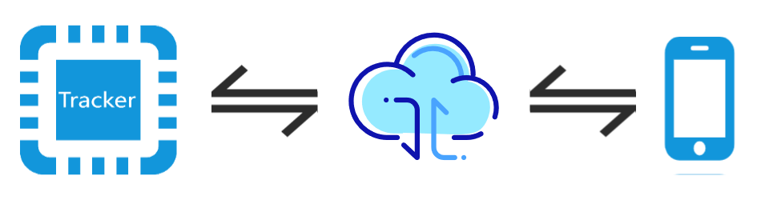
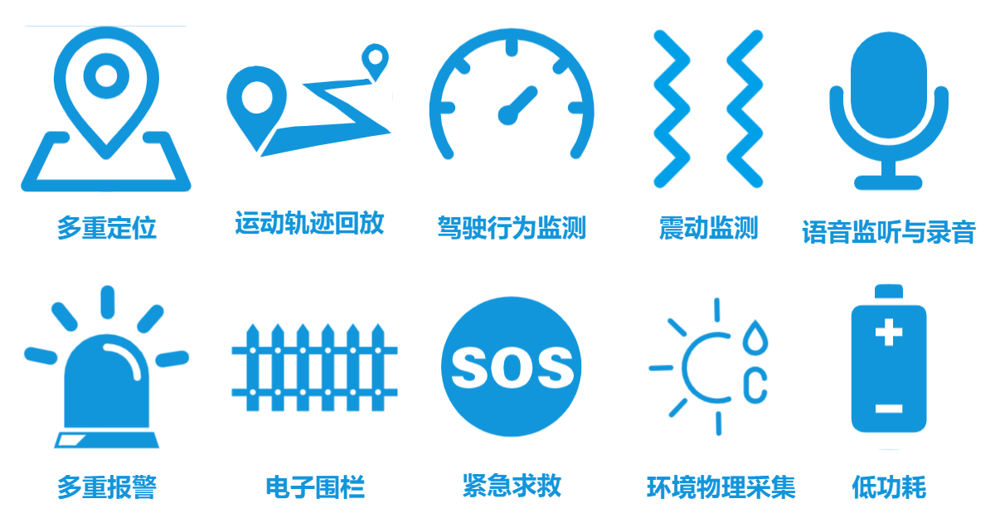

# Tracker-v2.0.0

## 修订历史

| Version | **Date**   | **Author** | **Change expression** |
| :------ | ---------- | ---------- | --------------------- |
| 2.0.0   | 2022-03-15 | 孙健       | 初始版本               |

## Tracker介绍

### Tracker

- Tracker, 智能跟踪定位器。是专门用于监控宿主的位置信息与运动状态, 以及对设备本身信息, 收集与整理后, 将设备信息与宿主信息通过无线网络传送至云端服务器的无线终端设备。
- 业务逻辑:
    - 在云端设置好需要采集的数据信息, 报警信息和控制参数;
    - 传感器或内置模块采集对应的数据信息, Quecpython整合好数据后, 通过MQTT协议发送至云端, 云端接收到数据可以进行分析、处理、显示、保存等操作;
    - 手机端向云端发送控制指令, 云端下发指令到设备模块, 控制模块的数据采集与上报的启用, 禁用和采集周期等。

### 功能模块

#### 手机端

- 设备管理
- 设备定位与轨迹查看
- 报警监控提醒
- 远程配置或控制

#### 云服务器端

- 产品管理
- 设备管理
- 用户管理
- 数据看板
- 远程配置与控制

#### 设备端

- 开机自检
- 系统复位(待实现)
- 充电开机(待实现)
- 低电关机
- 电量指示灯(待实现)
- 运行状态指示灯(待实现)
- 多重定位
- 语音监听(待实现)
- 录音上报(待实现)
- 设备信息上报
- OTA升级(待实现)
- 故障报警
- 低电报警
- 超速报警
- 拔卡报警
- 拆卸报警
- 振动报警
- 驾驶行为监测(待实现)
- SOS一键报警(待实现)
- 电子围栏(待实现)

### 应用行业

- 车载定位
- 物流货运
- 人员定位
- 电子学生证
- 宠物定位
- 特殊行业(农业灌溉, 稀有物种监控等)
