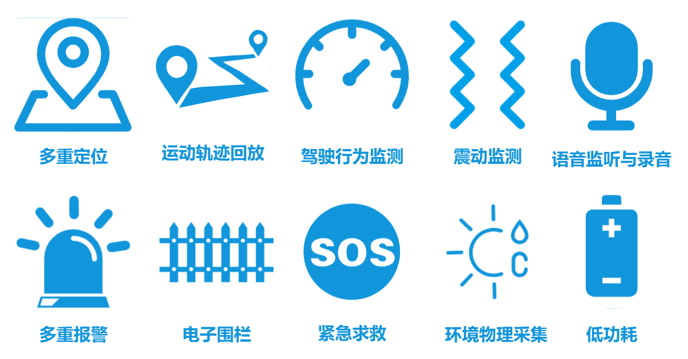

# Smart Tracker Solution for QuecPython

[中文](readme_zh.md) | English

Welcome to the QuecPython Tracker Solution repository! This repository provides a comprehensive solution for developing Tracker device applications using QuecPython.

## Table of Contents

- [Introduction](#introduction)
- [Functions](#Functions)
- [Getting Started](#getting-started)
  - [Prerequisites](#prerequisites)
  - [Installation](#installation)
  - [Running the Application](#running-the-application)
- [Directory Structure](#directory-structure)
- [Contributing](#contributing)
- [License](#license)
- [Support](#support)

## Introduction

### Overview

- Smart tracker
- Terminal device functions meet the majority of requirements in tracker application scenarios
- The visual operation platform and the mobile APP make device management and data viewing more convenient.


### Features

- Intelligent perception, recognition, and reporting of location information and danger alarms.
- Support integration with various IoT platforms such as Alibaba IoT Platform, ThingsBoard, and other private services.
- Secondary development with QuecPython to formulate modular and customizable solutions, thus shortening development cycles.
- Visual operation platform and mobile APP to control terminal devices.

### Applications

- Vehicle tracking
- Logistics and transportation
- People tracking
- Electronic student ID card
- Pet tracking
- Special industries (agricultural irrigation, rare species monitoring, etc.)


## Functions

- Multi-technology positioning, geo-fence alarm, danger alarm, SOS alarm reporting, audio monitoring, recording, historical track playback, remote control, etc.
- Smart positioning
  - The system utilizes 4G communication/multi-technology positioning/distributed services to provide a one-stop solution from end to service for the smart tracker industry.
- All-platform support
  - The device operation platform and mobile APP have all-round functions, enabling terminal device manufacturers to quickly manage devices and end users without the need to build your own service platforms.
- Reliable and stable
  - The terminal device has high positioning accuracy, high sensitivity to danger perception, low power consumption, and stable operation. Terminal device manufacturers can develop customized solutions directly based on the public version, greatly shortening the hardware development cycle.



## Getting Started

### Prerequisites

Before you begin, ensure you have the following prerequisites:

- **Hardware**:

  - A set of EC200UEUAA QuecPython standard development board with LTE antenna Type-C data cable, etc

    > Click for Tracker EVB's [schematic](https://python.quectel.com/en/wp-content/uploads/sites/2/2024/11/EC200U_A_C4-P01-Series-EVB_SCH.pdf) and [silk screen](https://python.quectel.com/en/wp-content/uploads/sites/2/2024/11/EC200U_A_C4-P01-Series-EVB_Silkscreen.pdf) documents.

  - PC (Windows 7, Windows 10, or Windows 11)

  - One GNSS antenna

  - A jumper cap

  - A functional Nano SIM card

- **Software**:
  - USB driver for the QuecPython module: [QuecPython_USB_Driver_Win10_U_G](https://python.quectel.com/wp-content/uploads/2024/09/Quectel_Windows_USB_DriverU_V1.0.19.zip)
  - debugging tool: [QPYcom](https://python.quectel.com/en/wp-content/uploads/sites/2/2024/11/QPYcom_V3.6.0.zip)
  - QuecPython firmware and related software resources.
  - Python text editor (e.g., [VSCode](https://code.visualstudio.com/), [Pycharm](https://www.jetbrains.com/pycharm/download/)).

### Installation

1. **Clone the Repository**:

   ```bash
   # 1.Pull the main project code
   git clone https://github.com/QuecPython/solution-tracker.git
   
   # 2.Enter the project
   cd solution-tracker/
   
   # 3.Checkout to master
   git checkout master
   
   # 4.Sub project init
   git submodule init
   
   # 5.Sub project code pull
   git submodule update
   
   # 6.Enter the sub project
   cd code/modules/
   
   # 7.checkout to master
   git checkout master
   ```

2. **Flash the Firmware**:
   Follow the [instructions](https://python.quectel.com/doc/Application_guide/en/dev-tools/QPYcom/qpycom-dw.html#Download-Firmware) to flash the firmware to the development board.

### Running the Application

1. **Connect the Hardware**:
   Connect the hardware according to the following diagram:
    
   1. Connect the antenna to the antenna connector marked with the word `LTE`.
   2. Connect the GNSS antenna to the antenna connector labeled with the word `GNSS`.
   3. Insert a usable Nano SIM card into the back of the development board at the position shown in the diagram.
   4. Use jumper caps to short circuit the two pins labeled with the word `GNSS-EN`, enabling the development board to have built-in GNSS functionality.
   5. Connect the development board and computer using a Type-C data cable.

2. **Download Code to the Device**:
   - Launch the QPYcom debugging tool.
   - Connect the data cable to the computer.
   - Follow the [instructions](https://python.quectel.com/doc/Application_guide/en/dev-tools/QPYcom/qpycom-dw.html#Download-Script) to import all files within the `code` folder into the module's file system, preserving the directory structure.

3. **Run the Application**:
   - Select the `File` tab.
   - Select the `_main.py` script.
   - Right-click and select `Run` or use the run shortcut button to execute the script.

## Directory Structure

```
solution-tracker/
├── code/
│   ├── modules/
│   │   ├── docs/
│   │   │   ├── en/
│   │   │   └── zh/
│   │   ├── aliIot.py
│   │   ├── battery.py
│   │   ├── buzzer.py
│   │   ├── common.py
│   │   ├── history.py
│   │   ├── led.py
│   │   ├── location.py
│   │   ├── logging.py
│   │   ├── net_manage.py
│   │   ├── player.py
│   │   ├── power_manage.py
│   │   ├── serial.py
│   │   ├── temp_humidity_sensor.py
│   │   └── thingsboard.py
│   ├── _main.py
│   ├── settings.py
│   ├── settings_loc.py.py
│   ├── settings_server.py
│   ├── settings_user.py
│   ├── tracker_ali.py
│   └── tracker_tb.py
├── docs/
│   ├── en/
│   │   └── media/
│   └── zh/
│       └── media/
├── object_model_demo/
│   └── ali_cloud_object_model.json
├── QPY_OCPU_BETA0001_EC200U_EUAA_FW/
│   └──  QPY_OCPU_BETA0001_EC200U_EUAA_FW.pac
├── .gitignore
├── .gitmodules
├── CHANGELOG.md
├── LICENSE
├── readme.md
└── readme_zh.md
```

## Contributing

We welcome contributions to improve this project! Please follow these steps to contribute:

1. Fork the repository.
2. Create a new branch (`git checkout -b feature/your-feature`).
3. Commit your changes (`git commit -m 'Add your feature'`).
4. Push to the branch (`git push origin feature/your-feature`).
5. Open a Pull Request.

## License

This project is licensed under the Apache License. See the [LICENSE](LICENSE) file for details.

## Support

If you have any questions or need support, please refer to the [QuecPython documentation](https://python.quectel.com/doc/en) or open an issue in this repository.
