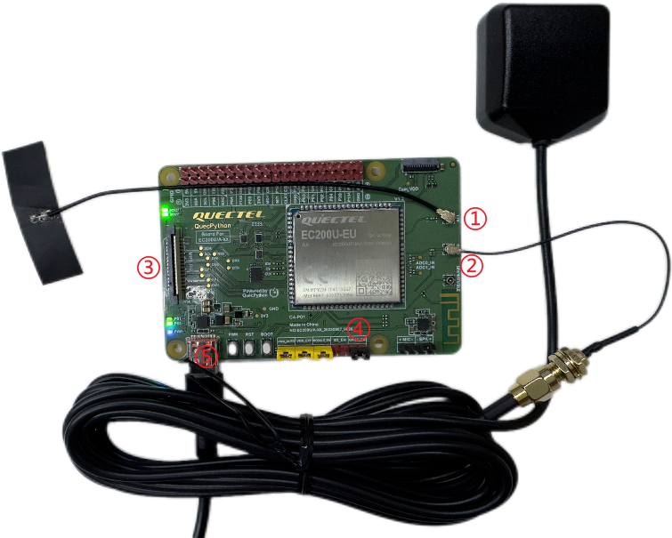

# QuecPython 智能定位器解决方案

中文 | [English](readme.md)

欢迎来到 QuecPython Tracker 解决方案仓库！本仓库提供了一个全面的解决方案，用于使用 QuecPython Tracker 设备应用程序。

## 目录

- [介绍](#介绍)
- [功能](#功能)
- [快速开始](#快速开始)
  - [先决条件](#先决条件)
  - [安装](#安装)
  - [运行应用程序](#运行应用程序)
- [目录结构](#目录结构)
- [贡献](#贡献)
- [许可证](#许可证)
- [支持](#支持)

## 介绍

### 产品概述

- Tracker 智能定位器
- 终端设备功能涵盖绝大部分定位器应用场景
- 可视化运营平台+手机 APP，设备管理和数据查看更方便


### 产品特点

- 位置信息、危险警情智能感知、识别和上报
- 支持阿里 IoT 平台、ThingsBoard、私有服务等多种 IoT 平台对接
- QuecPython 二次开发，模块化、定制化、缩短开发周期
- 可视化运营平台、手机 APP 控制终端

### 应用行业

- 车载定位
- 物流货运
- 人员定位
- 电子学生证
- 宠物定位
- 特殊行业(农业灌溉, 稀有物种监控等)


## 功能

- 多重定位、安全围栏、危险报警、紧急求救、语音监听、录音、轨迹回放、远程控制等
- 智能定位
  - 系统利用 4G 通信/多重定位/分布式服务等技术，为智能定位器行业提供从端到服务的一站式解决方案
- 全平台支持
  - 设备运营平台和手机 APP 功能齐全，终端设备厂商无需自行搭建服务平台即可快速实现对设备和终端用户的管理
- 可靠稳定
  - 终端设备定位精度高、危险感知灵敏度高、功耗低、运行稳定，终端设备厂商可套壳即用，极大缩短硬件开发周期


## 快速开始

### 先决条件

在开始之前，请确保您具备以下先决条件：

- **硬件：**

  - Windows 电脑一台，建议 `Win10` 系统

  - 一套 [EC200UEUAA QuecPython 标准开发板](https://python.quectel.com/doc/Getting_started/zh/evb/ec200x-evb.html)（含 LTE 天线、 Type-C 数据线等）

    > 点击查看 Tracker 定位器开发板的[原理图](https://python.quectel.com/wp-content/uploads/2024/09/EC200UA_C4-P01%E7%B3%BB%E5%88%97%E5%BC%80%E5%8F%91%E6%9D%BF%E5%8E%9F%E7%90%86%E5%9B%BE.pdf)和[丝印图](https://python.quectel.com/wp-content/uploads/2024/09/EC200UA_C4-P01%E7%B3%BB%E5%88%97%E5%BC%80%E5%8F%91%E6%9D%BF%E4%B8%9D%E5%8D%B0.pdf)文档。

  - 一根 [GNSS天线](https://e.tb.cn/h.TpAFyEz02BnCHRD?tk=fznae6ITVEX)

  - 一个排针跳线帽

  - 一张可正常使用的 Nano SIM 卡

- **软件：**

  - QuecPython 模块的 USB 驱动：[QuecPython_USB_Driver_Win10_U_G](https://python.quectel.com/wp-content/uploads/2024/09/Quectel_Windows_USB_DriverU_V1.0.19.zip)
  - 调试工具 [QPYcom](https://images.quectel.com/python/2022/12/QPYcom_V3.6.0.zip)
  - QuecPython 固件及相关软件资源
  - Python 文本编辑器（例如，[VSCode](https://code.visualstudio.com/)、[Pycharm](https://www.jetbrains.com/pycharm/download/)）

### 安装

1. **克隆仓库**：

   ```bash
   # 1.拉取主项目代码
   git clone https://github.com/QuecPython/solution-tracker.git
   
   # 2.进入项目根目录
   cd solution-tracker/
   
   # 3.切换对应的主项目分支
   git checkout master
   
   # 4.子项目初始化
   git submodule init
   
   # 5.子项目代码拉取
   git submodule update
   
   # 6.进入子项目目录
   cd code/modules/
   
   # 7.切换对应的子项目分支
   git checkout master
   ```

2. **烧录固件：**
   按照[说明](https://python.quectel.com/doc/Application_guide/zh/dev-tools/QPYcom/qpycom-dw.html#%E4%B8%8B%E8%BD%BD%E5%9B%BA%E4%BB%B6)将固件烧录到开发板上。

### 运行应用程序

1. **连接硬件：**
   按照下图进行硬件连接：

    

   1. 将 LTE 天线连接至标识有 `LTE` 字样的天线连接座上
   2. 将 GNSS 天线连接至标识有 `GNSS` 字样的天线连接座上
   3. 在图示位置开发板背面插入可用的 Nano SIM 卡
   4. 使用跳线帽将标识有 `GNSS_EN` 字样的两根排针短接，使能开发板内置 GNSS 功能
   5. 使用 Type-C 数据线连接开发板和电脑

2. **将代码下载到设备：**
   - 启动 QPYcom 调试工具。
   - 将数据线连接到计算机。
   - 按照[说明](https://python.quectel.com/doc/Application_guide/zh/dev-tools/QPYcom/qpycom-dw.html#%E4%B8%8B%E8%BD%BD%E8%84%9A%E6%9C%AC)将 `code` 文件夹中的所有文件导入到模块的文件系统中，保留目录结构。

3. **运行应用程序：**
   - 选择 `File` 选项卡。
   - 选择 `_main.py` 脚本。
   - 右键单击并选择 `Run` 或使用`运行`快捷按钮执行脚本。

## 目录结构

```plaintext
solution-tracker/
├── code/
│   ├── modules/
│   │   ├── docs/
│   │   │   ├── en/
│   │   │   └── zh/
│   │   ├── aliIot.py
│   │   ├── battery.py
│   │   ├── buzzer.py
│   │   ├── common.py
│   │   ├── history.py
│   │   ├── led.py
│   │   ├── location.py
│   │   ├── logging.py
│   │   ├── net_manage.py
│   │   ├── player.py
│   │   ├── power_manage.py
│   │   ├── serial.py
│   │   ├── temp_humidity_sensor.py
│   │   └── thingsboard.py
│   ├── _main.py
│   ├── settings.py
│   ├── settings_loc.py.py
│   ├── settings_server.py
│   ├── settings_user.py
│   ├── tracker_ali.py
│   └── tracker_tb.py
├── docs/
│   ├── en/
│   │   └── media/
│   └── zh/
│       └── media/
├── object_model_demo/
│   └── ali_cloud_object_model.json
├── QPY_OCPU_BETA0001_EC200U_EUAA_FW/
│   └──  QPY_OCPU_BETA0001_EC200U_EUAA_FW.pac
├── .gitignore
├── .gitmodules
├── CHANGELOG.md
├── LICENSE
├── readme.md
└── readme_zh.md
```

## 贡献

我们欢迎对本项目的改进做出贡献！请按照以下步骤进行贡献：

1. Fork 此仓库。
2. 创建一个新分支（`git checkout -b feature/your-feature`）。
3. 提交您的更改（`git commit -m 'Add your feature'`）。
4. 推送到分支（`git push origin feature/your-feature`）。
5. 打开一个 Pull Request。

## 许可证

本项目使用 Apache 许可证。详细信息请参阅 [LICENSE](LICENSE) 文件。

## 支持

如果您有任何问题或需要支持，请参阅 [QuecPython 文档](https://python.quectel.com/doc)或在本仓库中打开一个 issue。
