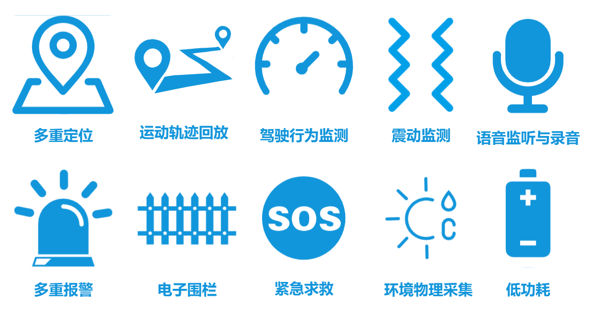
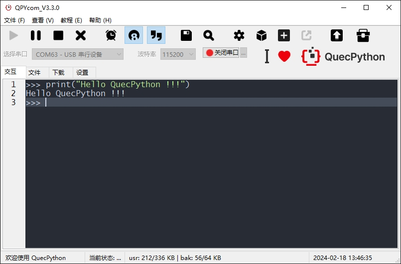

# QuecPython 智能定位器解决方案

中文 | [English](readme.md) | [日本語](readme_jp.md)

## Tracker 介绍

### 产品概述

- Tracker智能定位器。
- 终端设备功能涵盖绝大部分定位器应用场景
- 可视化运营平台+手机APP, 设备管理和数据查看更方便

### 产品功能

- 多重定位、安全围栏、危险报警、紧急求救、语音监听、录音、轨迹回放、远程控制等
- 智能定位
    - 系统利用4G通信/多重定位/分布式服务等技术, 为智能定位器行业提供从端到服务的一站式解决方案
- 全平台支持
    - 设备运营平台和手机APP功能齐全, 终端设备厂商无需自行搭建服务平台即可快速实现对设备和终端用户的管理
- 可靠稳定
    - 终端设备定位精度高、危险感知灵敏度高、功耗低、运行稳定, 终端设备厂商可套壳即用, 极大缩短硬件开发周期

### 产品特点

- 位置信息、危险警情智能感知、识别和上报
- 支持阿里Iot平台、ThingsBoard、私有服务等多种Iot平台对接
- QuecPython二次开发, 模块化、定制化、缩短开发周期
- 可视化运营平台、手机APP控制终端

### 应用行业

- 车载定位
- 物流货运
- 人员定位
- 电子学生证
- 宠物定位
- 特殊行业(农业灌溉, 稀有物种监控等)

## 移远Tracker智能定位器及其能力

### 产品能力

- **通道支持阿里Iot平台、ThingsBoard、私有服务平台等多种平台(目前暂只支持阿里Iot平台和ThingsBoard平台, 其他平台正在开发中)**
- **支持本地和远程参数配置**
- **支持OTA升级**
- **支持数据离线存储**
    - 在网络连接不稳定情况下, 将发送失败的数据暂存至本地, 在网络恢复后优先将本地数据发送至服务端
    - 离线存储的数据量可通过配置文件配置
- **支持常用的传感器和输入设备**
    - 传感器:
        - 照度传感器
        - 三轴加速度传感器
        - 温湿度传感器
        - ...
    - 输入设备
        - 麦克风
        - ...
- **支持QuecPython, 可以使用Python代码快速实现二次开发**

### 产品配套组件

#### QPYcom工具

QPYcom工具是一个集**QuecPython repl交互、PC和模组间文件传输、文件系统镜像制作并打包到固件包、及固件烧录等各种功能**于一体的强大利器。

用户如需进行二次开发, 使用QPYcom将会大大提高开发的效率。

[点此下载QPYCom工具。](https://python.quectel.com/download)

QPYCom的使用文档, 参见安装目录下的`docs`文件夹。

### 产品优势

- **多重定位**
    - 支持GPS、BDS、GLONASS、Galileo, 支持Wi-Fi、基站定位, 世界任意角落, 都能精准定位
- **1000mah**
    - 超低功耗, 超长待机, 理论待机>8000天
- **传感器**
    - 加速传感器、温湿度传感器、光照传感器, 极大扩展使用场景, 冷链运输、物流监控, 不在话下
- **宽电压支持**
    - 最低9v, 最高108v, 不论是小轿车、大货车、新能源汽车, 还是两轮电动车, 统统支持
- **疾速定位**
    - AGPS加持, 疾速定位, 急脾气？别着急。定位器比你更“疾”
- **隐蔽安装**
    - 可磁吸、可粘扣、可固定、可移动, 定位效果无所遁形, 定位器杳无踪迹
- **低成本开发**
    - 可使用Python进行二次开发, 降低软件开发成本
    
    - 我司多平台模组适用, 使用Python开发, 无需修改代码即可快速切换至不同模组
- **强大的客户服务和技术支持能力**

## 移远Tracker智能定位器的工作流程

### 危险报警、紧急求救

### 远程控制

## 拉取完整代码工程

### 说明

本项目包含有一个`modules`子项目, 拉取代码时需将子项目一并拉去下来进行使用。

### 拉取步骤

1 拉取主项目代码

- `git clone https://github.com/QuecPython/solution-tracker.git`

2 进入项目根目录

- `cd solution-tracker/`

3 切换对应的主项目分支

- `git checkout master`

4 子项目初始化

- `git submodule init`

5 子项目代码拉取

- `git submodule update`

6 进入子项目目录

- `cd code/modules/`

7 切换对应的子项目分支

- `git checkout master`
